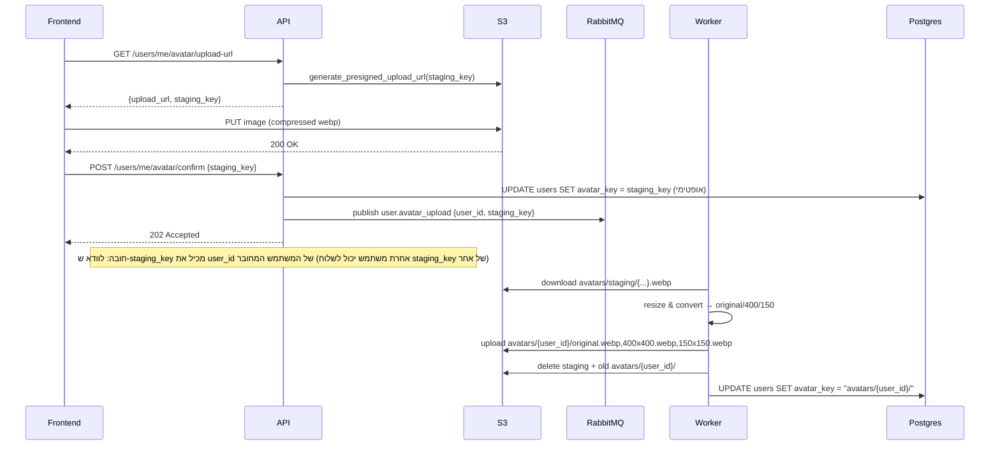

# ריפקטור העלאת אווטאר – Presigned URL + Worker

## 1. מה קיים היום (היי-לבל)

- **מודל User – DB**: בקובץ `[backend/app/domain/users/model.py](backend/app/domain/users/model.py)` השדה הוא `avatar_url = Column(String(255), nullable=True)` ושומר **URL מלא של S3**.
- **סכמות User – API**: בקובץ `[backend/app/domain/users/schema.py](backend/app/domain/users/schema.py)`:
  - `UserRead` כולל `avatar_url: Optional[str]`.
  - `UserUpdate` כולל `avatar_url: Optional[str]`.
  - קיימות סכמות ייעודיות ל-presigned URL (`AvatarUploadUrlRequest/Response`, `AvatarUploadConfirmRequest`).
- **שירות S3 – StorageService**: בקובץ `[backend/app/infrastructure/s3/service.py](backend/app/infrastructure/s3/service.py)`:
  - `STAGING_PREFIX = "avatars/staging/"`, `FINAL_PREFIX = "avatars/"`.
  - `upload_avatar_to_staging(...)` מעלה ל-`avatars/staging/{user_id}_{uuid}.ext`.
  - `generate_avatar_upload_url(...)` כבר מחזיר `(presigned_url, staging_key)` ל-staging.
  - `finalize_avatar(staging_key, user_id, base_name)` מעתיק מ-staging ל-final `avatars/{base_name}-{user_id}.ext` ומעדכן URL.
  - `upload_user_avatar`, `delete_old_avatar`, `delete_avatar_by_user_id` – זרימה ישנה, מבוססת URL מלא.
- **סרוויס Users**: בקובץ `[backend/app/domain/users/service.py](backend/app/domain/users/service.py)`:
  - `schedule_avatar_upload` מעלה ל-staging, מאפס `avatar_url` ב-DB, ומפרסם אירוע `user.avatar_upload` ל-RabbitMQ.
  - `get_avatar_upload_url`/`confirm_avatar_upload` כבר קיימים, אבל עדיין עובדים מול `avatar_url` ואירוע `user.avatar_upload` בזרימה הישנה.
  - `remove_avatar` מוחק לפי `avatar_url` (דרך `delete_avatar_by_user_id`) ומאפס `avatar_url`.
  - `update_avatar` משתמש ב-`upload_user_avatar` (העלאה דרך API) ומעדכן `avatar_url`.
- **Worker – Avatar Tasks**: בקובץ `[backend/app/workers/tasks/avatar_tasks.py](backend/app/workers/tasks/avatar_tasks.py)`:
  - מאזין ל-`user.avatar_upload` ו-`user.avatar_remove`.
  - `_handle_avatar_upload`:
    - מקבל `{ user_id, staging_key, old_avatar_url? }`.
    - מוחק תמונה ישנה לפי URL (אם יש), מוחק לפי `user_id`, קורא `finalize_avatar`, ומעדכן `user.avatar_url` ב-DB.
  - `_handle_avatar_remove` מוחק מה-S3 את התיקיות/קבצים הישנים לפי user_id.
- **Endpoints – Users Router**: בקובץ `[backend/app/api/v1/routers/users.py](backend/app/api/v1/routers/users.py)`:
  - `GET /me/avatar/upload-url` – כבר קיים ומחזיר `AvatarUploadUrlResponse` (upload_url + staging_key).
  - `POST /me/avatar/confirm` – קורא ל-`user_service.confirm_avatar_upload` ומחזיר 202.
  - `POST /me/avatar` – העלאה ישירה דרך API (`schedule_avatar_upload`).
  - `DELETE /me/avatar` – דוחף אירוע מחיקה (`remove_avatar`).
- **S3 Client**: בקובץ `[backend/app/infrastructure/s3/client.py](backend/app/infrastructure/s3/client.py)` מוגדרים `bucket_name = settings.S3_BUCKET_NAME` ו-`AWS_REGION`, ו-`_public_url(...)` מחזיר את ה-URL המלא.
- **Frontend – פרופיל**: בקובץ `[frontend/src/pages/Profile.tsx](frontend/src/pages/Profile.tsx)`:
  - משתמש ב-`user.avatar_url` מכל ה-API.
  - מעלה דרך `POST /users/me/avatar` עם `FormData` (קובץ).
  - עושה polling עד שה-worker יסיים ויעדכן `avatar_url` ב-DB.
  - מציג את התמונה עם cache-buster (`?_v=...`).
- **Frontend – צ'אט**:
  - רשימות ושיחות (`[frontend/src/pages/Messages.tsx](frontend/src/pages/Messages.tsx)`, `[frontend/src/pages/MessageThread.tsx](frontend/src/pages/MessageThread.tsx)`) משתמשות במבני Chat/Conversation שכוללים `avatar_url` (מגיעים מ-domain chat/auth).

## 2. הארכיטקטורה החדשה (תרשים זרימה)

## 3. שינויים בבקאנד – Domain & DB

### 3.1 מודל User ו-Schemas

- `**[backend/app/domain/users/model.py](backend/app/domain/users/model.py)**`
  - להחליף `avatar_url = Column(String(255), nullable=True)` ב-`avatar_key = Column(String(255), nullable=True)`.
  - הערה לוגית: `avatar_key` ישמור **רק prefix** של התיקייה: `"avatars/{user_id}/"`.
- **Migration Alembic**
  - ליצור קובץ חדש ב-`backend/alembic/versions/` עם:
    - `ALTER TABLE users RENAME COLUMN avatar_url TO avatar_key;`
    - אפשר להשאיר את האורך הקיים (500) או 255 – לפי הגדרת המודל.
    - אין צורך ב-data migration (DB ריק).
- `**[backend/app/domain/users/schema.py](backend/app/domain/users/schema.py)`**
  - ב-`UserRead`:
    - להחליף `avatar_url: Optional[str] = None` ב-`avatar_key: Optional[str] = None`.
    - להוסיף properties/שדות מחושבים:
      - `avatar_url_small` (150x150) – `https://{bucket}.s3.{region}.amazonaws.com/{avatar_key}150x150.webp`.
      - `avatar_url_medium` (400x400) – דומה עם `400x400.webp`.
  - ב-`UserUpdate`:
    - להסיר `avatar_url` (כדי שלא יעדכנו URL ידנית).
  - סכמות נוספות שקשורות לאווטאר (`UserAvatarResponse`, וכו') – לעדכן או להחליף בשדות החדשים אם הן עדיין בשימוש.
- **סכמות/דומיינים נוספים שמשתמשים ב-avatar_url**
  - `[backend/app/domain/chat/schema.py](backend/app/domain/chat/schema.py)` – מכיל `avatar_url` למשתמשים בצ'אט.
  - `[backend/app/domain/auth/schema.py](backend/app/domain/auth/schema.py)` – מחזיר `avatar_url` למשתמש מחובר.
  - **תכנון**: להשאיר API תואם בקירוב ע"י הוספת השדות החדשים, ובהמשך אפשר להחליף הפניות מ-`avatar_url` ל-`avatar_url_small/medium` בצ'אט ובפרונט.

## 4. שינויים בבקאנד – S3 & Worker & Service

### 4.1 StorageService – S3

בקובץ `[backend/app/infrastructure/s3/service.py](backend/app/infrastructure/s3/service.py)`:

- **להשאיר ולעדכן** `generate_avatar_upload_url`:
  - לקבע סיומת ל-`webp` ומפתח staging חדש: `avatars/staging/{user_id}_{uuid}.webp`.
  - `content_type = "image/webp"` תמיד.
- **להסיר**
  - `upload_avatar_to_staging` (לא נדרש כשהכל עובר דרך presigned URL).
  - `finalize_avatar` (עובר ללוגיקה חדשה ב-image_processor).
  - `upload_user_avatar` (העלאה ישירה דרך API – מתייתר).
  - `delete_old_avatar` (מחיקה לפי URL של S3).
- **להוסיף**:
  - פונקציה `list_and_delete_prefix(prefix: str)` או דומה – שימוש חוזר.
  - `delete_user_avatar_folder(user_id: Union[UUID, str])`:
    - מחשב prefix `avatars/{user_id}/`.
    - משתמש ב-`list_objects_by_prefix` + `delete_object` לכל key.

### 4.2 Image Processor – Worker-Side S3 Logic

- ליצור קובץ חדש `[backend/app/infrastructure/s3/image_processor.py](backend/app/infrastructure/s3/image_processor.py)`:
  - להשתמש ב-Pillow (כבר קיים `Pillow==10.2.0` ב-`requirements.txt`).
  - להגדיר:
    - קבוע `SIZES = {"original.webp": (800, 800), "400x400.webp": (400, 400), "150x150.webp": (150, 150)}`.
  - פונקציה `async def process_and_save_avatar(staging_key: str, user_id: str, s3_client: S3Client) -> str`:
    - מורידה את התמונה מ-staging (`avatars/staging/...`).
    - עבור כל גודל:
      - פותחת ב-Pillow, מבצעת crop למרכז ל-square, resize, שומרת כ-WebP ל-buffer.
      - מעלה ל-`avatars/{user_id}/{filename}` דרך `s3_client.upload_fileobj`.
    - מוחקת את כל התיקייה הישנה `avatars/{user_id}/` לפני ההעלאה (או מיד אחרי הורדה, לפני העלאת החדשים).
    - מוחקת את קובץ ה-staging.
    - מחזירה `avatar_key = f"avatars/{user_id}/"`.

### 4.3 Worker – Avatar Tasks

בקובץ `[backend/app/workers/tasks/avatar_tasks.py](backend/app/workers/tasks/avatar_tasks.py)`:

- ב-head imports:
  - לייבא את `process_and_save_avatar` ואת `s3_client`.
- ב-`_handle_avatar_upload`:
  - להחליף את הלוגיקה של `finalize_avatar` + `delete_old_avatar`/`delete_avatar_by_user_id` ב:
    - קריאה ל-`process_and_save_avatar(staging_key, str(user_id), s3_client)`.
    - עדכון `user.avatar_key = returned_avatar_key` (למשל `"avatars/{user_id}/"`).
  - לא צריך עוד להתעסק ב-`old_avatar_url` (ניתן להוריד מה-payload בהמשך, אחרי הניקוי).
- ב-`_handle_avatar_remove`:
  - במקום לקרוא ל-`delete_avatar_by_user_id`, להשתמש ב-`delete_user_avatar_folder` החדש.

### 4.4 שירות Users – לוגיקת אווטאר

בקובץ `[backend/app/domain/users/service.py](backend/app/domain/users/service.py)`:

- **schedule_avatar_upload** (אם עדיין בשימוש):
  - ניתן להשאיר או לפשט בהתאם לזרימה החדשה. במודל החדש כל ההעלאות אמורות לעבור דרך presigned URL, לכן אפשר להוריד/להפנות לזרימה החדשה בלבד.
- **get_avatar_upload_url**:
  - נשאר דומה – קורא ל-`storage_service.generate_avatar_upload_url` ומחזיר `presigned_url, staging_key`.
- **confirm_avatar_upload**:
  - **ולידציית אבטחה (חובה):** לוודא ש-`staging_key` **מכיל** את ה-`user_id` של המשתמש המחובר (פורמט: `avatars/staging/{user_id}_...`). אם לא — להחזיר 403/400 ולא לעדכן DB. אחרת משתמש יכול לשלוח `staging_key` של משתמש אחר.
  - לעדכן מיידית ב-DB: `user.avatar_key = staging_key` (אופטימי — הפרונט יראה תמונה מ-staging עד שה-worker יסיים)
    - זו ההחלטה של **optimistic UI** – הפרונט יוכל כבר להראות את התמונה שהועלתה ל-staging.
  - לפרסם לאירועים (`user.avatar_upload`) את הנתונים `{ user_id, staging_key }` (לא צריך `old_avatar_url`).
- **remove_avatar**:
  - לקרוא ל-`delete_user_avatar_folder(user_id)` דרך `StorageService`.
  - לעדכן `user.avatar_key = None` ב-DB.
  - לפרסם אירוע `user.avatar_remove` אם עדיין יש צורך בתור (אפשר גם לבטל ולהסתפק במחיקה ישירה, בהתאם להחלטה).
- **update_avatar** (API הישנה):
  - או להסיר אותה, או להפנות לזרימה החדשה (לא לקבל יותר קבצים ישירות).

## 5. שינויים בבקאנד – Users Router (HTTP API)

בקובץ `[backend/app/api/v1/routers/users.py](backend/app/api/v1/routers/users.py)`:

- **GET /me/avatar/upload-url**:
  - נשאר כמעט זהה; אולי עדכון קל בתיעוד לזרימה החדשה (staging webp בלבד).
- **POST /me/avatar/confirm**:
  - לוודא שה-Request משתמש ב-`AvatarUploadConfirmRequest`.
  - לקרוא לפונקציה החדשה של `user_service.confirm_avatar_upload` שמעדכנת `avatar_key` ושולחת אירוע ל-RabbitMQ.
  - להחזיר 202 + הודעה מתאימה.
- **POST /me/avatar** (העלאה דרך השרת):
  - להסיר את ה-endpoint הזה (הזרימה החדשה היא תמיד Presigned URL).
- **DELETE /me/avatar**:
  - לעדכן כך שיקרא ל-`user_service.remove_avatar` החדשה שמוחקת את התיקייה `avatars/{user_id}/` ומאפסת `avatar_key`.

## 6. שינויים בפרונטאנד

### 6.1 כלי עזר – דחיסת תמונה

- ליצור קובץ `[frontend/src/utils/imageUtils.ts](frontend/src/utils/imageUtils.ts)`:
  - פונקציה `compressImage(file: File, options: { maxWidth: number; quality: number }): Promise<Blob>`.
  - מימוש עם Canvas API:
    - קריאת `File` ל-`HTMLImageElement`.
    - resize פרופורציונלי ל-maxWidth (וגובה) ושמירה כ-WebP (`canvas.toBlob(..., 'image/webp', quality)`).

### 6.2 Profile Page – זרימת העלאה חדשה

בקובץ `[frontend/src/pages/Profile.tsx](frontend/src/pages/Profile.tsx)`:

- להחליף את handler ההעלאה הקיים (שעושה `POST /users/me/avatar` ו-polling) ב:
  - `handleAvatarUpload(file: File)` כפי שתיארת:
    - `setAvatarPreview(URL.createObjectURL(file))` – Optimistic UI.
    - `const compressed = await compressImage(file, { maxWidth: 800, quality: 0.85 })`.
    - `const { data: { upload_url, staging_key } } = await api.get('/users/me/avatar/upload-url', { params: { filename: file.name } })`.
    - `await fetch(upload_url, { method: 'PUT', body: compressed, headers: { 'Content-Type': 'image/webp' } })`.
    - `await api.post('/users/me/avatar/confirm', { staging_key })`.
    - `await refreshUser()` כדי למשוך את ה-`avatar_key` המעודכן / ה-URLים החדשים.
- עדכון הלוגיקה שמציגה את האווטאר:
  - להשתמש ב-`user.avatar_url_medium` לתמונה הראשית בפרופיל.
  - אם התמונה לא נטענת – לשמור את fallback כפי שעכשיו (אות ראשונה, וכו').

### 6.3 צ'אט ורשימות – שימוש בגדלים קטנים

- `[frontend/src/pages/Messages.tsx](frontend/src/pages/Messages.tsx)` ורכיבים נוספים שמציגים רשימות משתמשים בצ'אט:
  - להשתמש ב-`avatar_url_small` (או `avatar_url_medium` לפי ה-UI) במקום ב-`avatar_url`.
- `[frontend/src/pages/MessageThread.tsx](frontend/src/pages/MessageThread.tsx)` – ב-header של השיחה:
  - להציג את אווטאר השותף עם `avatar_url_small` (150x150) ליד השם.

## 7. נקודות לבקרה ובדיקה

- **בדיקות ידניות**:
  - העלאת אווטאר חדש: לבדוק שה-upload לספריית staging עובד, שה-worker יוצר 3 גדלים בתיקייה `avatars/{user_id}/`, וש-`avatar_key` מתעדכן.
  - העלאה חוזרת: לוודא שהתיקייה הישנה נמחקת לפני העלאת הקבצים החדשים.
  - מחיקת אווטאר: לוודא ש-`avatars/{user_id}/` נמחקת ו-`avatar_key` מתאפסת.
  - פרונט: לוודא ש-preview מיידי עובד, ושאחרי `refreshUser` נטענים ה-URLים החדשים בלי צורך ב-polling ארוך.
- **ביצועים**:
  - לבדוק זמני עיבוד של Pillow על תמונות גדולות, ולהתאים maxWidth/quality במידת הצורך.
- **אבטחה**:
  - לוודא ש-`staging_key` שנשלח ב-`/me/avatar/confirm` שייך ל-user המחובר (prefix + user_id).

## 8. S3 CORS (הגדרה ב-AWS, לא בקוד)

כשהפרונט מעלה ישירות ל-S3 עם presigned URL, ה-bucket חייב לאפשר PUT מ-origin של הפרונט (למשל `http://localhost:5173` בפיתוח, ו-domain הפרודקשן בפרודקשן). זו **הגדרה ב-AWS Console** (או ב-Terraform/CloudFormation) — לא חלק מהקוד.

- להוסיף הערה/תיעוד: בקובץ `[backend/app/infrastructure/s3/client.py](backend/app/infrastructure/s3/client.py)` — הערה בראש הקובץ או ליד `generate_presigned_upload_url` שמזכירה ש-CORS של ה-bucket חייב לכלול את ה-origin של הפרונט.
- להוסיף קובץ תיעוד (למשל `docs/S3_CORS.md`) עם דוגמת `cors_configuration` ל-AWS S3 (JSON) שמאפשר PUT מ-localhost:5173 ו-origin הפרודקשן.

