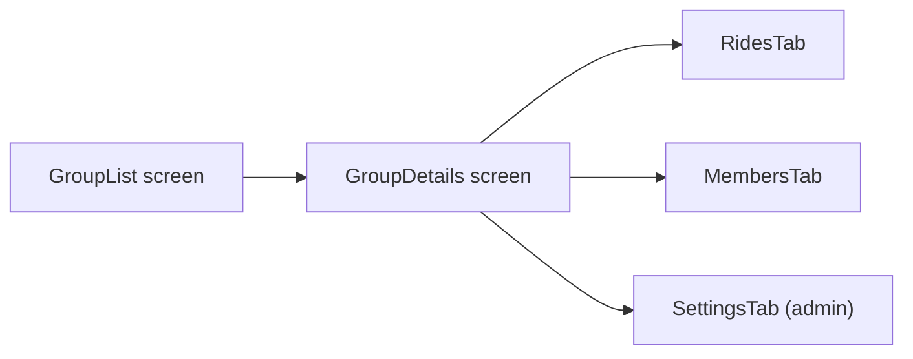

### מטרות

- להגדיר **פונקציונליות** ברורה לקבוצות: מה מנהל יכול לעשות, מה חבר רגיל יכול לעשות, ואיך זה משפיע על נסיעות.
- לעצב **זרימה מסודרת** בממשק: מה רואים כשלוחצים על קבוצה, איפה נמצאות ההגדרות, איפה נמצאים כפתורי יציאה/מחיקה/הזמנה.
- להחליט על **דפוסי שימוש מקובלים** (conventions) כדי שההתנהגות תהיה אינטואיטיבית למשתמשים.

### מבנה תפקידים והרשאות

- **Owner / מנהל קבוצה**
  - יצירת קבוצה, עריכת שם ותמונה.
  - הזמנת אנשים (קישור הזמנה / הוספה ידנית אם יש צורך בעתיד).
  - הסרת חברים מהקבוצה.
  - סגירת / מחיקת הקבוצה (קביעה אם למחוק לצמיתות או "לסגור" כך שאי אפשר לפרסם עוד נסיעות).
  - העברת בעלות למנהל אחר (אופציונלי לשלב ראשון, מומלץ בהמשך).
  - שליטה בהגדרות: האם חברים יכולים להזמין אחרים, האם הקבוצה היא פתוחה / דורשת אישור, ברירת מחדל לחשיפת נסיעות.
- **חבר קבוצה רגיל**
  - לראות נסיעות שמסומנות לקבוצה.
  - לפרסם נסיעה ולסמן שהיא שייכת לקבוצה (כבר היום קיים אצלך רעיון כזה).
  - לצאת מהקבוצה (כפתור Leave Group ברור במסך הקבוצה ובפרופיל/רשימת הקבוצות).
  - לדווח על תוכן (אופציונלי, לשלב אבטחה/מדיניות בהמשך).

### מה רואים כשלוחצים על קבוצה

תבנית יחסית סטנדרטית (בדומה ל-WhatsApp Groups / Facebook Groups / Telegram):

- **Header עליון** (תמיד מוצג):
  - תמונת קבוצה (avatar מעוגל/מרובע).
  - שם הקבוצה.
  - תג קטן: סוג קבוצה (פתוחה / פרטית / סגורה) + מספר חברים.
  - מצד ימין (RTL): כפתור "חזרה" (לרשימת קבוצות).
  - מצד שמאל: אייקון "⋯" או גלגל שיניים:
    - לחבר רגיל: תפריט עם `צפה בפרטי קבוצה`, `צא מהקבוצה`.
    - למנהל: `הגדרות קבוצה`, `נהל חברים`, `סגור קבוצה`.
- **אזור תוכן מרכזי** – מומלץ להשתמש ב-tabs או segmentation ברור:
  - Tab ברירת מחדל: **"נסיעות"** – רשימת נסיעות ששויכו לקבוצה.
    - כפתור CTA בולט: **"צור נסיעה בקבוצה"** שמקפיץ מסך יצירת נסיעה כאשר הקבוצה הנוכחית כבר מסומנת בשדה הקבוצות.
  - Tab שני: **"חברים"** – רשימת חברים עם avatar + שם.
    - אצל מנהל: ליד כל חבר כפתור קונטקסטואלי `⋯` → `הסר מהקבוצה`, `קדם למנהל` (אם תתמכו בכך).
  - Tab שלישי (למנהל בלבד או לכולם לקריאה): **"הגדרות"** – עריכת פרטי הקבוצה.

### תמונת קבוצה

- שדה `image_url` בישות הקבוצה (כבר יש לך לוגיקת S3 ל-avatars, אפשר למחזר):
  - במסך `GroupDetails` הצגת ה-avatar.
  - במסך "הגדרות קבוצה" כפתור: **"שנה תמונה" → בחר קובץ → העלאה ל-S3 → שמירה ב-API**.
- הרשאות:
  - רק מנהל יכול לשנות תמונה.
  - חברים רגילים רק רואים.

### כפתור יציאה מהקבוצה

- חשובה נראות גבוהה אבל לא בולטת מדי (שלא ילחצו בטעות):
  - בממשק הקבוצה, בתחתית `GroupDetails` או ב-`Settings` עבור חבר רגיל: כפתור טקסט/outline אדום: **"צא מהקבוצה"**.
  - בתפריט הקורא (אייקון ⋯ בחלק העליון) אפשרות נוספת: `צא מהקבוצה`.
- התנהגות:
  - לחיצה → Modal אישור: "אתה בטוח? לא תראה יותר נסיעות של קבוצה זו".

### הרשאות מנהל – ממשק

- **ניהול חברים** (בטאב "חברים" או במסך משני `ManageMembers`):
  - רשימת חברים + חיפוש.
  - כפתור `הסר` לכל חבר (חוץ מהבעלים).
- **עריכת פרטים** (Tab "הגדרות"):
  - שדות: `שם קבוצה`, `תיאור (אופציונלי)`, `תמונה`, `סוג קבוצה` (פתוחה / עם אישור / סגורה להזמנה בלבד).
  - Switch לברירת מחדל של פרסום נסיעות: public / רק חברי קבוצה.
- **סגירת / מחיקת קבוצה**:
  - אפשרות בתחתית `Settings` עם כפתור אדום: `סגור קבוצה`.
  - החלטה מוצרית:
    - "סגירה" = אין פרסום נסיעות חדשות לקבוצה, אבל ההיסטוריה נשארת ל-view.
    - "מחיקה" מלאה – רק אם באמת צריך; עדיף מבחינת UX ל"סגור". אפשר להסתיר קבוצה מחברי הקבוצה ולהשאיר אותה רק למנהל.

### האם כדאי לשלוח הודעות בקבוצה

- מקובל היום בשירותים דומים שני דברים נפרדים:
  - **צ'אט אחד-על-אחד** סביב נסיעה ספציפית (כבר יש לך מערכת צ'אט). זה כיסוי טוב לרוב הצרכים.
  - **צ'אט קבוצה** (כמו קבוצת ווטסאפ) – יכול להיות כבד יחסית: עוד זרם התראות, moderation, סינון.
- המלצה שלי לשלב ראשון:
  - **לא** להוסיף עוד צ'אט קבוצה מלא כרגע.
  - כן לשקול **Announcements** (פוסטים קצרים של מנהל, לדוגמה "שיניתי את שעת היציאה"), שמופיעים מעל feed הנסיעות או בלשונית קטנה, בלי מערכת הודעות נפרדת.
  - אם בעתיד תראה שהמשתמשים צריכים ערוץ דיבור פתוח – אפשר להוסיף group chat כטאב נוסף בקבוצה (`צ'אט הקבוצה`).

### כפתור הגדרות לקבוצה

- מאוד מקובל לשים **גלגל שיניים / ⋯** בחלק העליון של מסך הקבוצה.
  - **לחבר רגיל**: `צפה בפרטים`, `הצג חברים`, `צא מהקבוצה`, `השתק התראות` (אם תתמכו).
  - **למנהל**: אותו תפריט + `ערוך שם ותמונה`, `נהל חברים`, `הגדרות פרטיות`, `סגור קבוצה`.
- ברמה הוויזואלית, זה נשאר עקבי עם שאר האפליקציה (כמו כפתור הגדרות בפרופיל, אם יש).

### איך למקם את כל הפונקציות במסך

- **רשימת קבוצות** (מסך Index):
  - כל קבוצה כ-Row: תמונה, שם, תת-כותרת (כמות חברים / פרטית/פתוחה), אייקון קטן שמסמן שאתה מנהל.
  - לחיצה על ה-row → מעבר למסך `GroupDetails`.
- **GroupDetails (ברירת מחדל – טאב נסיעות)**:
  - למעלה: Header עם שם, תמונה, type, אייקון הגדרות.
  - מתחת: Tabs `נסיעות | חברים | (הגדרות)`.
  - Floating button או כפתור בראש רשימת הנסיעות: `+ יצירת נסיעה בקבוצה`.
- **Tab חברים**:
  - רשימת חברים.
  - למנהל: ליד כל שורה כפתור `⋯` להסרה / קידום.
- **Tab הגדרות** (למנהל):
  - קבוצה של שדות עריכה.
  - מתחת – בלוק מסוכן (Danger zone) עם `סגור קבוצה`.

### מה לגבי תצורת הנראות של נסיעות (כללי / קבוצה)

כרגע:

- יש מצב "כללי" שכולם רואים בו הכל.
- ובמסך יצירת נסיעה אפשר לבחור קבוצה, ואז רק חברי הקבוצה רואים.

זה **רעיונית נכון ומקובל** – כמעט כל מערכת עם קבוצות עובדת כך:

- אפשר לפרסם פוסט/נסיעה **לכולם** (public feed).
- אפשר לפרסם **לקבוצה מוגדרת** בלבד.

המלצות שיכולות לחדד את זה:

- במסך יצירת נסיעה:
  - Radio buttons: `נראות` → `ציבורי (כולם)` / `קבוצה מסוימת`.
  - אם בוחרים "קבוצה מסוימת" – נפתח select של הקבוצות שאתה חבר בהן.
  - בהמשך אפשר לשקול בחירה של **יותר מקבוצה אחת** (אבל בשלב ראשון עדיף אחת, כדי לא לסבך את הממשק והלוגיקה).
- במסכי ה-feed:
  - מסך נפרד: `כל הנסיעות` (public + אולי נסיעות מהקבוצות שלך מסומנות בטאג קבוצה).
  - מסך לכל קבוצה: רק נסיעות של אותה קבוצה.

### פונקציונליות נוספת שכדאי לשקול לקבוצה

- **סוגי קבוצה**:
  - פתוחה – כל אחד יכול להצטרף.
  - מאושרת – שליחת בקשת הצטרפות שהמנהל מאשר.
  - בהזמנה בלבד – רק דרך קישור הזמנה / הוספה ע"י מנהל.
- **הזמנות**:
  - יצירת קישור הזמנה עם תוקף / כמות שימושים (בהמשך).
- **ניהול התראות**:
  - אפשרות לחבר להשתיק התראות מקבוצה ספציפית.
- **Role נוסף (Moderator)**:
  - אם הקבוצות יהיו גדולות, אפשר לאפשר למנהל למנות "עוזרי מנהל" עם חלק מההרשאות.

בהמשך, כשתרצה לממש, נוכל לגזור מזה משימות קונקרטיות בקוד: עדכוני סכמת DB לקבוצה (שם, תיאור, תמונה, סטטוס), עדכוני endpoints ב-backend לניהול קבוצה וחברים, וקומפוננטות חדשות/מעודכנות ב-`GroupManage` ו-`GroupDetails` בפרונטנד.