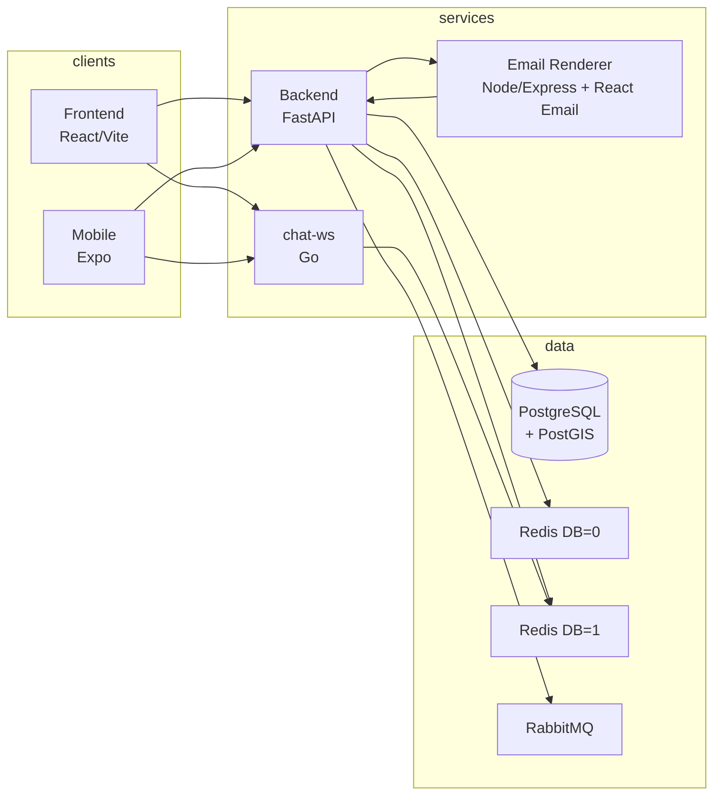

# Linkup — Ride-Sharing Platform

A full-stack ride-sharing application where drivers post rides, passengers search and book, and real-time chat with AI-powered conversation summaries keeps everyone in sync.

Production: **[https://linkup.itamarabir.com](https://linkup.itamarabir.com)**

---

## What Linkup Does

Linkup connects drivers and passengers for shared rides. Drivers publish trips with origin, destination, date, and available seats. Passengers search (read-only query), can **save a passenger request** to be notified when a driver publishes a matching ride (email/push via outbox and `is_notification_active`), send booking requests, and get approved or rejected by drivers. Once a booking is confirmed, driver and passenger chat in real time over WebSocket. When a conversation ends, an AI pipeline (Groq / Llama) analyzes the chat and sends an email summary. The app supports Google OAuth and email/password login, profile avatars (S3), geo routing and distance calculation, and push, email, and in-app notifications—all backed by an outbox pattern for reliable event delivery.

---

## Engineering highlights (portfolio)

Single doc for **stack, scale patterns, real-time chat (disconnect / last-seen debounce), Outbox, ops, CI/CD, tests, k6 load testing, auth under concurrent load (sync vs async), phone validation, frontend refactor, i18n/locale/error fallbacks/CSS fonts**: **[docs/ENGINEERING_HIGHLIGHTS.md](docs/ENGINEERING_HIGHLIGHTS.md)**.
Deferred/next-step architecture decisions (including cache stampede Phase 2 early refresh rationale): **[docs/FUTURE_WORK.md](docs/FUTURE_WORK.md)**.

### Recent production upgrades

- CI builds/pushes runtime images to GHCR; deploy pulls immutable tags on EC2.
- Rolling backend deploy with health-gated rollback (`docker compose ... --wait`).
- Compose env hardening with multiple env files and fail-fast checks.
- RabbitMQ reliability upgrades: self-healing consumer + DLQ tooling + metrics.
- Atomic Redis rate limiting with split algorithms (sliding-window for auth, token-bucket for chat) + `X-RateLimit-*` headers.
- Frontend data layer standardized with TanStack React Query (`QueryClient`, typed query-key factories, bounded retry policy with `Retry-After` support, and Sentry dedup via `__sentryCaptured` marker).
- Stage 3b React Query migration completed for `GroupContext` and `MyRides`: query-driven groups/rides state, mutation-based ride cancel flow, and WS-driven cache invalidation.
- Stage 3b Part 2 completed for `MyBookings` (driver + passenger): both hooks now use React Query with user-scoped booking keys, mutation-driven approve/reject/cancel flows, and websocket-triggered cache invalidation while preserving existing view-model contracts.
- Stage 3c admin migration completed: legacy `useAdminFetch` was replaced by domain-scoped hooks under `frontend/src/features/admin/queries` and `frontend/src/features/admin/mutations` (`Users`, `Rides`, `Groups`, `Outbox`, `Health`, `Stats`).
- Admin lookup flow (`AdminLookup`) now follows RQ on-demand pattern via `useMutation` (ride/booking lookup), replacing manual async result-state handling.
- Stage 3d (safe subset) completed for Chat: `useChatUnreadMessages` and `useChatNotificationsFeed` moved from manual intervals to React Query polling, and `Messages` conversations list moved from manual fetch state to `qk.chat.conversations()` while preserving WS-driven chat transport layers unchanged.
- Stage 3b Part 6 completed for passenger search flows: `useSearchRides` moved network edges (`search`, `load more`, `save alert`) to React Query mutations while preserving wizard/AI/geolocation/token race logic; `useJoinRide` request-scoped idempotency remains unchanged.
- Stage 5 cleanup completed: `useMyRequests` migrated to React Query (`qk.passengers.requests` + mutation cache patching for cancel/expire), and `AuthContext` initial boot effect fixed with a proper cancellable async pattern (removed dead mounted guard).
- OpenAPI-to-frontend contract hardening shipped: Orval codegen from `frontend/openapi-snapshot.json` now generates committed client/types under `frontend/src/api/generated` using the shared Axios mutator, with CI drift enforcement (`npm run gen:api` + `git diff --exit-code -- src/api/generated/`).
- Login form migrated to `react-hook-form` + `zod` schema validation, preserving existing auth/navigation behavior and UI structure while reducing manual form state boilerplate.
- S.6 client-side throttle shipped in frontend HTTP layer (`frontend/src/api/throttle.ts`) and wired as the first Axios request interceptor (`frontend/src/api/client.ts`) for bounded request bursts.
- Bundle budget tooling shipped: `rollup-plugin-visualizer`, `size-limit`, and explicit Vite `manualChunks` strategy (`react-vendor`, `query`, `firebase`, `sentry`, `i18n`, `forms`, `charts`).
- A11y heading/landmarks cleanup shipped: removed duplicate generic `h1` ("LinkUp") from route shells, standardized route-level semantic headings (`sr-only` when visual heading is absent), and added shared `usePageTitle` for route-specific `document.title`.
- A11y guardrails strengthened in DEV: `eslint-plugin-jsx-a11y` enforcement + runtime `@axe-core/react` checks.
- Loading-state a11y completed: `PageLoading` and `ProtectedRoute` loading branch now render `<main aria-busy aria-live>` + `<h1 sr-only>` (i18n `common:loading`), so axe stays clean across Suspense/auth-bootstrap frames.
- Google Identity Services lifted to module-level singleton (`gisLoader.ts`) — script load + `initialize()` are idempotent, eliminating the `initialize() called multiple times` warning under StrictMode and stale `onError` identities. DEV-only pre-flight log surfaces effective clientId+origin and exact diagnose steps for 403.
- Google Sign-In local 403 playbook documented: `http://localhost:5173` must be registered in OAuth authorized origins/redirects; recommended long-term setup is a dedicated local OAuth client via `VITE_GOOGLE_CLIENT_ID`.
- Stage 3a RQ migration shipped: `useGoogleMapsKey` moved to React Query (`qk.geo.mapsKey`), Notifications page moved from manual fetch state to `qk.notifications.all()` with event-driven invalidation, and AuthContext now syncs `qk.auth.me()` cache (plus `useCurrentUser` hook).
- Premium frontend flow shipped: profile upsell/banner (`PremiumBanner`), checkout trigger, and protected payment result pages (`/payment/success`, `/payment/cancel`) wired to billing status polling.
- S.7 Asset hardening shipped: targeted `img` eager/lazy + `fetchpriority` tuning, locale preload + S3 preconnect hints in `index.html`, and hybrid i18n loading (`common`/`nav` bundled + feature namespaces lazy-loaded from `/public/locales` via `i18next-http-backend`).
- Web Vitals D shipped: production-only Sentry RUM (`BrowserTracing` + `Replay` with sampled sessions), dynamic `web-vitals` reporting (CLS/LCP/INP), and `Sentry.setUser` wiring in auth login/google-login/logout/bootstrap flows.
- Frontend sourcemap upload hardening shipped: Vite integrates `@sentry/vite-plugin` behind production+env guards (`SENTRY_AUTH_TOKEN`, `SENTRY_ORG`, `SENTRY_PROJECT`), CI injects secrets only in `publish-image`, and uploaded sourcemaps are deleted from `dist` after upload.
- Frontend runtime config via startup `envsubst` (`window.__APP_CONFIG__`).
- Redis Sentinel HA + PgBouncer runtime pooling + direct migrate path.
- Automated JWT secret sync between backend and chat-ws during deploy.
- OAuth popup compatibility headers in nginx (`COOP` / `COEP`).
- Nginx probe routing hardening: exact-match `/livez` and loopback-only `/readyz` to prevent frontend fallback and readiness information exposure.
- Edge hardening in nginx: `listen 443 ssl http2`, HSTS (`includeSubDomains`), `X-Content-Type-Options`, `X-Frame-Options`, `Referrer-Policy`, `Permissions-Policy`, and staged `Content-Security-Policy-Report-Only` with `report-uri` telemetry.

**Interview prep (navigation + per-feature why / alternatives):** **[docs/internal/INTERVIEW_PLAYBOOK.md](docs/internal/INTERVIEW_PLAYBOOK.md)**, **[docs/FEATURE_DECISIONS.md](docs/FEATURE_DECISIONS.md)**. ADR deep dives: **[docs/adr/README.md](docs/adr/README.md)**.
פרונט — רשימת ריפקטור מפורטת: **[frontend/docs/FRONTEND_REFACTOR_AND_QUALITY.md](frontend/docs/FRONTEND_REFACTOR_AND_QUALITY.md)**.  
**FCM (Web push — `data` map מהשרת; SW + Toast ב־`App.tsx` + צליל; רישום אחרי login ב־`AuthContext`, ניקוי טוקן ב-logout):** **[docs/FCM_SYSTEM_SUMMARY.md](docs/FCM_SYSTEM_SUMMARY.md)**.  
**Deployment / production runbook:** **[docs/DEPLOYMENT.md](docs/DEPLOYMENT.md)**. **Ops incidents & monitoring:** **[docs/operations/RUNBOOK.md](docs/operations/RUNBOOK.md)**, **[docs/operations/MONITORING.md](docs/operations/MONITORING.md)**.  
**מסך אדמין פנימי (React, `/admin`, lazy routes, סטטיסטיקות + משתמשים + נסיעות/קבוצות + Outbox + חיפוש):** **[ADMIN_DASHBOARD.md](ADMIN_DASHBOARD.md)**.  
**שגיאות API אחידות (`error_code`, `trace_id`, `LinkupError`):** **[docs/ERRORS.md](docs/ERRORS.md)** — בקאנד handlers מרוכזים; בפרונט `utils/apiError.ts` + `ChatErrorBoundary`; ב-chat-ws לוגים עם `slog` ותגובות JSON ל-HTTP.

---

## Architecture



- **Frontend / Mobile** → REST to backend, WebSocket to chat-ws.  
- **Backend / workers** → PostgreSQL (data), Redis DB=0 (cache, rate limit, ride `broadcast`), Redis DB=1 (**chat** + **`publish_user_event`** / `user:{id}:events`, chat completion), RabbitMQ (async tasks, notifications), **email-renderer** (`POST /render` for HTML generation).  
- **chat-ws** → Redis DB=1 only (subscribe to chat channels, presence, **`user:online` / `user:offline`**, and per-user domain events pattern **`user:*:events`**, fan out to connected clients).

---

## Services

| Service   | Language        | Role |
|----------|------------------|------|
| backend  | Python (FastAPI) | REST API, auth, rides, bookings, chat CRUD, **groups**, passengers (requests/matches), **admin JSON API** (`/api/v1/admin/*`), events via Outbox + LISTEN/NOTIFY |
| notification-worker | Python | Outbox dispatcher + notifications consumer (email/push/user refresh events) |
| task-worker | Python | Avatar pipeline + scheduled tasks + scheduled publisher (**single replica**) |
| ai-worker | Python | Chat completion listener + AI conversation analysis |
| chat-ws  | Go               | WebSocket server; chat + typing + presence; Redis Pub/Sub including **`user:online` / `user:offline`** and **`user:*:events`** (ride/maintenance-style JSON to the logged-in client) |
| email-renderer | Node.js / Express / React Email | Dedicated email HTML rendering microservice (`/health`, `/render`), shared by backend notification flow |
| frontend | React / TypeScript | Web app (Vite); Hebrew RTL |
| mobile   | React Native / Expo | Mobile app (TypeScript) |

---

## Tech Stack

| Category      | Technologies |
|---------------|--------------|
| **Backend**   | Python, FastAPI, PostgreSQL, PostGIS, SQLAlchemy (async), Alembic, Redis, RabbitMQ, Firebase (FCM), S3 (**optional CloudFront** for public media URLs via `CLOUDFRONT_DOMAIN`), Groq (AI), Brevo |
| **Email rendering** | Node.js, Express, React, React Email, `react-dom/server` |
| **Real-time** | Go (chat-ws), Redis Pub/Sub |
| **Frontend**  | React, TypeScript, Vite, Google Maps |
| **Mobile**    | React Native, Expo, TypeScript |
| **Infrastructure** | Docker, Docker Compose, Kubernetes (manifests in repo) |
| **Cloud / CI** | GitHub Actions, GHCR (GitHub Container Registry), Docker |
| **Scaling & reliability** | Request ID (X-Request-ID), structured JSON logging (**python-json-logger** v3+); unified **`LinkupError`** JSON responses — **[docs/ERRORS.md](docs/ERRORS.md)**; RabbitMQ broker-native retry (DLX/TTL + `x-death`) + DLQ; pessimistic locking (booking approve/cancel); **configurable SQLAlchemy async pool** (`DB_POOL_*` in `.env`), DB indexes |

---

## Key Features

- ✅ **Rides & bookings:** ride search, booking requests, driver approve/reject; **start/end ride** from "My Bookings" (driver tab; requires at least one confirmed passenger). **My Bookings** uses **aggregated REST reads** — [`GET /bookings/driver-summary`](docs/architecture/API.md) and [`GET /bookings/passenger-summary`](docs/architecture/API.md) — so the web app avoids N+1 (one round-trip each for driver/passenger tabs). Frontend: [`useMyBookingsDriver.ts`](frontend/src/pages/MyBookings/useMyBookingsDriver.ts) / [`useMyBookingsPassenger.ts`](frontend/src/pages/MyBookings/useMyBookingsPassenger.ts) + [`useMyBookings.ts`](frontend/src/pages/MyBookings/useMyBookings.ts) returns a **nested view-model** (`passenger`, `driver`, `chat`) with exported **`MyBookingsViewModel`**; DTO-to-UI mapping is centralized in [`myBookings.mappers.ts`](frontend/src/pages/MyBookings/myBookings.mappers.ts). UI split into [`PassengerBookingCard.tsx`](frontend/src/pages/MyBookings/PassengerBookingCard.tsx) + tabs. Backend: [`BookingReadsService.get_driver_summary` / `get_passenger_summary`](backend/app/domain/bookings/booking_reads_service.py) (lifecycle mutations remain in [`BookingService`](backend/app/domain/bookings/service.py)), CRUD with `joinedload` + `with_loader_criteria` for filtered bookings on rides.
- ✅ **Async core flow refactor (Passenger/Booking/Ride):** core passenger-request, booking, and ride flows were migrated to SQLAlchemy 2.0 async patterns (`AsyncSession`, `select/execute`). **Bookings** are now async-only (no `db.run_sync`) and use `select(...).with_for_update()` where needed for race safety.
- ✅ **Scheduled notifications & Redis publisher:** pickup/driver reminders use the `scheduled_notifications` table (Alembic **008**); `ReminderScheduler` loads due rows and hands off to the notification handler. [`publisher.py`](backend/app/infrastructure/redis/publisher.py): **`publish_ride_event`** → `broadcast` / **DB 0**; **`publish_user_event`** → [`redis_chat_pubsub`](backend/app/infrastructure/redis/chat_pubsub.py) / **`REDIS_CHAT_URL`** (אותו DB כמו chat-ws) לערוץ `user:{user_id}:events` מ-[`keys.py`](backend/app/infrastructure/redis/keys.py). Legacy `reminder_sent` columns were removed from ORM/API after migration **008**; dead reminder/expiry CRUD and `ride_expiry.py` were deleted.
- ✅ **Frontend user event stream:** [`useUserEventStream`](frontend/src/hooks/useUserEventStream.ts) on the chat WebSocket parses **Zod**-validated `UserEvent` messages ([`wsEvents.ts`](frontend/src/types/wsEvents.ts)); **HistorySection** and My Rides / Bookings hooks consume these for active vs past UI.
- ✅ **Chat WS inbound validation:** new chat messages on the same WebSocket are validated with **`ChatMessageSchema`** ([`wsEvents.ts`](frontend/src/types/wsEvents.ts)) in [`processChatWebSocketMessage.ts`](frontend/src/pages/MessageThread/processChatWebSocketMessage.ts); validated payloads are mapped explicitly to **`MessageResponse`** (no loose `as unknown as` casts).
- ✅ **Chat plaintext guard (XSS hardening):** backend chat input now rejects HTML tags at schema validation (`MessageCreate.reject_html` in [`backend/app/domain/chat/schema.py`](backend/app/domain/chat/schema.py)); policy is **plaintext-only chat**, preventing stored HTML payloads from entering the message pipeline.
- ✅ **Missed messages + read receipts:** chat reconnect fetches missed messages using `after=message_id`; read receipts now use a DB-level cursor (`conversation_participants.last_read_message_id`) and color `✓✓` on every outgoing message whose `message_id` is covered by the partner's read cursor.
- ✅ **Inbox chat N+1 fix:** [`list_my_conversations`](backend/app/domain/chat/service.py) now uses a batched aggregate read (`get_inbox_aggregates` in [`backend/app/domain/chat/crud.py`](backend/app/domain/chat/crud.py)) so inbox queries stay constant (no per-conversation `get_last_message` / `has_unread_messages` round-trips).
- ✅ **Unified WebSocket notifications via `chat-ws`:** user-domain refresh events (`user:*:events`) are delivered over the same `chat-ws` connection to reduce concurrent sockets per client.
- ✅ **Worker split + autoscaling:** legacy monolith worker was split into `notification-worker`, `task-worker`, `ai-worker`; each has dedicated K8s deployment/HPA.
- ✅ **Task worker safety:** `task-worker` is pinned to one replica to avoid duplicate scheduled task publishing.
- ✅ **Per-worker DB connection caps:** explicit `DB_POOL_SIZE`/`DB_MAX_OVERFLOW` per worker keeps total DB usage below Postgres defaults.
- ✅ **PgBouncer (transaction pooling, internal-only):** backend + workers connect via `pgbouncer` service (no public port), `migrate` stays direct to `db`, asyncpg statement cache is disabled at engine connect for compatibility, and PgBouncer runtime now uses a custom image (`infrastructure/pgbouncer/Dockerfile`) so mounted config is not overridden by third-party entrypoints.
- ✅ **RabbitMQ client/channel topology:** `rabbit_client` (API publish), `outbox_rabbit_client` (Outbox publish), ו-`worker_rabbit_client` (worker consume/scheduler) מופרדים; ה-consumers משתמשים בחיבור worker משותף עם channel מבודד לכל queue. הגדרות התורים מרוכזות ב-`backend/app/infrastructure/rabbitmq/topology.py`.
- ✅ **RabbitMQ operability tooling:** `notification-worker` כולל `run_dlq_monitor` (warning/critical thresholds ל-DLQ depth) ונוסף כלי replay אופרטיבי `scripts/ops/rabbitmq-dlq-replay.py` להחזרת הודעות מ-`.dlq` לתור הראשי בצורה מבוקרת.
- ✅ **Redis Sentinel HA:** compose now runs `redis-primary` + `redis-replica` + `redis-sentinel`; Python Redis clients use `redis.asyncio.Sentinel` (with URL fallback), and `chat-ws` connects via `go-redis` failover client.
- ✅ **Redis reconnect hardening:** reconnect loop uses retry with exponential backoff for resilient long-lived pub/sub connections.
- ✅ **Geocode retry hardening:** Google geocoding flow includes bounded retries via `tenacity` for transient failures/timeouts.
- ✅ **Notification worker (async):** [`notification_tasks.py`](backend/app/workers/tasks/notification_tasks.py) uses `await db.execute(select(...))` for ride-cancel fan-out (no `run_sync` in app code paths); **`ride.cancelled_by_driver`** notifies only bookings still **PENDING** or **CONFIRMED** (not already cancelled by the passenger).
- ✅ **Frontend types vs Phase 9:** `reminder_sent` removed from booking-related TypeScript types ([`api.ts`](frontend/src/types/api.ts), [`myBookings.types.ts`](frontend/src/pages/MyBookings/myBookings.types.ts)) to match the public API after migration **008**.
- ✅ **Passenger requests (בקשות טרמפ):** חיפוש נסיעות (`GET …/passengers/search-rides`) בלי שמירה; **שמירת התראה** — `POST …/passengers/` עם אותם פרמטרי מסלול + `is_notification_active` / `group_id`; הצטרפות מתוצאות (`request-ride-from-search`); ביטול בקשה; התאמות; קישור אופציונלי מבוקינג לבקשה
- ✅ **Groups:** create group, join by invite code, manage members (remove, promote to admin), group rides and search; group avatar & description (S3); leave group / close group (admin)
- ✅ Real-time chat (WebSocket) between driver and passenger; **presence**: `users.last_active_at` + debounced PATCH on disconnect; **WS** `user_online` / `user_offline` for immediate header status (see `docs/architecture/REALTIME.md`)
- ✅ AI conversation summary (Groq / Llama) and email on chat end
- ✅ **AI free-text assistants (rides):** both passenger search and driver CreateRide use `POST /api/v1/passenger/passengers/ai-parse-search` to prefill route fields; CreateRide keeps stricter rules (future date+time required) and never auto-submits.
- ✅ **Billing (Stripe, production-hardened):** `/api/v1/billing/*` flow for premium checkout/status/history/webhook, with idempotent webhook processing (`stripe_event_id` + `payment_intent` guards), enum-backed payment statuses, deterministic `Decimal` amount handling, and frontend integration via React Query + profile Premium banner + payment success/cancel routes.
- ✅ Push (**FCM**): מהשרת רק מפת **`data`** ב־FCM; בחזית Toast ב־`App.tsx` + צליל, ברקע SW (`push`); רישום טוקן ב־`AuthContext` אחרי login, ניקוי ב־logout; מייל (**Brevo**) — **`docs/FCM_SYSTEM_SUMMARY.md`**
- ✅ **In-app notification feed (web):** חיבור ראשי ל־**`GET /api/v1/notifications/ws?token=JWT`** דרך [`useChatNotificationsWebSocket`](frontend/src/context/useChatNotificationsWebSocket.ts) על גבי [`useReconnectingWebSocket`](frontend/src/hooks/useReconnectingWebSocket.ts); ב־**`onOpen`** (כולל אחרי reconnect) — רענון פיד, unread ואירוע מותאם `linkup-notifications-refresh`. גיבוי: [`useChatNotificationsFeed`](frontend/src/context/useChatNotificationsFeed.ts) — polling REST כל **~5 דקות**. פירוט: [`ARCHITECTURE.md`](ARCHITECTURE.md) (סעיף In-app notifications), [`docs/architecture/REALTIME.md`](docs/architecture/REALTIME.md).
- ✅ **Chat RQ migration (safe subset):** manual polling/fetch surfaces were migrated to React Query — [`useChatUnreadMessages`](frontend/src/context/useChatUnreadMessages.ts) now uses `qk.chat.unread()` polling + invalidate refresh API, [`useChatNotificationsFeed`](frontend/src/context/useChatNotificationsFeed.ts) now uses `qk.notifications.all()` polling + invalidate refresh API, and [`Messages.tsx`](frontend/src/pages/Messages.tsx) now uses `qk.chat.conversations()` query with preserved sort/render semantics; WS transport/message-stream layers remain unchanged by design.
- ✅ Google OAuth and email/password auth with JWT + refresh
- ✅ Geo: distance, route display, PostGIS-backed queries; **ride preview cache** (Redis, 24h) for route options + **geocode cache** (Redis, 24h, Google Geocoding) for address→coords reuse to reduce repeated external API calls
- ✅ **GPS live tracking:** driver and passengers share location during active rides (REST → Redis Pub/Sub → WebSocket). Permission and ride-status checks for **POST /bookings/{id}/location** and **passenger-location** live in [`BookingLocationService.broadcast_driver_location` / `broadcast_passenger_location`](backend/app/domain/bookings/location_service.py) (thin routers; classes also re-exported from [`service.py`](backend/app/domain/bookings/service.py) for compatibility). The web app resolves the driver’s `booking_id` for GPS from the **confirmed passenger row** on the active ride (same data as the driver-summary passenger list). Location POSTs are throttled (~1.5s); map markers update in place — see [`docs/architecture/REALTIME.md`](docs/architecture/REALTIME.md) (GPS Tracking).
- ✅ **Group tags** on ride/booking cards (group name or "ציבורי"); RTL: route as destination ← origin; close button (×) top-left on cards
- ✅ Profile and avatar upload (S3)
- ✅ Outbox pattern for reliable event publishing to RabbitMQ
- ✅ **Internal admin dashboard (web):** lazy-loaded routes under **`/admin`** — stats, health, users (toggle active/admin), rides (list + cancel), groups, outbox (inspect + requeue FAILED), ride/booking lookup; gated by **`user.is_admin`** (מ-JWT / תשובת login); מעטפת **דסקטופ** (סיידבר קבוע, בלי drawer מובייל); mutations behind confirm + toasts; backend **`/api/v1/admin/*`** + `[admin_audit]` logging — see **[ADMIN_DASHBOARD.md](ADMIN_DASHBOARD.md)**
- ✅ **Admin modernization phase shipped:** dedicated admin pages/routes for **Bookings**, **Billing**, **Audit**, and **Ops** (`/admin/bookings`, `/admin/billing`, `/admin/audit`, `/admin/ops`) with new backend read endpoints, server-side pagination contracts, and capability-aware guards for sensitive reads.
- ✅ Kubernetes-ready (manifests in `k8s/`)
- ✅ **API errors:** מערכת שגיאות אחידה (`error_code`, `trace_id`, payload אופציונלי), handlers ל-validation/DB/`LinkupError` — **[docs/ERRORS.md](docs/ERRORS.md)**
- ✅ **i18n, לוקאליזציה וטיפוגרפיה (ווב):** **i18next** עם משאבים ב־`frontend/src/i18n/locales/{he,en}/` (למשל `common.json`, `nav.json`). **`LangContext`** מגדיר `dir` על `<html>` ומעדכן **`--font-primary`** (עברית: Heebo, אנגלית: DM Sans). פורמט תאריכים/שעות לפי שפת הממשק דרך **`frontend/src/utils/date.ts`** ו־**`getLocale()`** — בלי `he-IL` קשיח ברוב הזרימות. ב־hooks ובלוגיקה מחוץ ל־React, fallback לטקסטי שגיאת API אחרי **`getApiErrorMessage`** עובר דרך **`apiErr('err_*')`** ב־[`frontend/src/utils/i18nError.ts`](frontend/src/utils/i18nError.ts) (מפתחות **`common:err_*`**). **CSS Modules:** `font-family: var(--font-primary)` / `var(--font-numeric)`; חריג מכוון לכפתור שפה — **`LangToggle`** (מונוספייס). פירוט החלטות: **[docs/adr/ARCHITECTURE_DECISIONS_FRONTEND.md](docs/adr/ARCHITECTURE_DECISIONS_FRONTEND.md)** (סעיפים 10–12).
- ✅ **S.7 Asset hardening (ווב):** lazy/eager loading הוגדר נקודתית ל-`img` קריטיים מול רשימות, נוספו hints ב-`index.html` (`preconnect` ל-`linkup-uploads.s3.amazonaws.com` + locale preloads), ו-`i18n` הועבר ל-hybrid loading: `common`/`nav` נשארים bundled inline, בעוד `auth`/`rides`/`bookings`/`groups`/`profile`/`billing` נטענים עצלנית דרך `i18next-http-backend` מ-`/locales/{{lng}}/{{ns}}.json` עם קבצי runtime תחת `frontend/public/locales/`.

---

## Getting Started

**Prerequisites:** Docker, Docker Compose, Node 20+ (for local Vite dev).

```bash
git clone <repository-url>
cd Linkup
```

## הרצה מקומית

### הכנה חד-פעמית

```bash
cp .env.example .env
cp backend/.env.example backend/.env
cp chat-ws/.env.example chat-ws/.env
cp frontend/.env.example frontend/.env
# ערוך כל קובץ והכנס סודות אמיתיים
```

- **`.env` בשורש** — רק משתנים ש־`docker-compose` צורך להקמת Postgres / Redis / RabbitMQ; יישור עם `POSTGRES_*`, `REDIS_PASSWORD`, `RABBITMQ_*` ב־`backend/.env`.
- **`chat-ws/.env`** — כולל `REDIS_URL` (לדוקר: `redis://:<סיסמה>@redis:6379/1`) ו־`JWT_SECRET` זהה ל־`SECRET_KEY` ב־`backend/.env`.
- **FCM בדוקר (Model B לפרודקשן):** אין mount של קובץ credentials. הגדר `FIREBASE_CREDENTIALS_JSON` ב־`backend/.env` (JSON בשורה אחת). `FIREBASE_SERVICE_ACCOUNT_PATH` מיועד לפיתוח מקומי בלבד.

**מיגרציות:** ב־**Docker Compose** שירות **`migrate`** מריץ `alembic upgrade head` פעם אחת לפני **backend** וכל ה־workers (`notification-worker`, `task-worker`, `ai-worker`). אם המיגרציה נכשלת ה־API וה־workers לא יעלו. **לוקאלי בלי Compose:** `cd backend && alembic upgrade head` (עם `db/schema.sql` כעזר) לפני `uvicorn`.

### פיתוח יומיומי

```bash
# טרמינל 1
make up

# טרמינל 2
cd frontend && make dev
```

> חשוב: השתמשו ב־`make up` (ולא `docker compose up` ישירות), כדי להבטיח ש־Compose תמיד רץ עם `--env-file backend/.env --env-file frontend/.env`.

- **פרונט:** http://localhost:5173  
- **אדמין (משתמש עם `is_admin`):** http://localhost:5173/admin — פירוט API ומבנה: [`ADMIN_DASHBOARD.md`](ADMIN_DASHBOARD.md)  
- **בקאנד:** http://localhost:8000  
- **Swagger:** http://localhost:8000/docs  
- **Backend בדוקר:** `backend/entrypoint.sh` מריץ `uvicorn` (בלי `alembic` באותה שורה); מספר workers לפי **`UVICORN_WORKERS`** ב-`backend/.env` (`.env.example`: **4**; אם חסר — **1**). **Healthcheck** על המיכל בודק `GET /api/v1/health` דרך `python` (מופיע כ־`healthy` ב־`docker compose ps` אחרי `start_period`).  
- צ׳אט בפיתוח: WebSocket ל־`localhost:8081`; WS נסיעות/התראות ל־`localhost:8000/api/v1` — ראו [`frontend/src/config/env.ts`](frontend/src/config/env.ts).

ב־[`docker-compose.yml`](docker-compose.yml) שירותי **`frontend`** ו־**`nginx`** מוגדרים עם `profiles: ["prod"]` — לא עולים ב־`docker compose up -d` ללא הפרופיל. בפרופיל prod, **nginx** תלוי ב־**backend** במצב **`service_healthy`** (לא רק `started`).

### בדיקת פרודקשן

```bash
docker compose --profile prod up -d --build
```

הכל מאחורי Nginx: http://localhost:80

### פקודות שימושיות

```bash
make down                    # עצור
docker compose down -v       # עצור + איפוס volumes (DB וכו׳)
make logs                    # לוגים לכל השירותים (follow)
docker compose logs migrate  # לוג מיגרציה (אם נכשל — לבדוק כאן)
docker compose logs backend  # לוגים לבקאנד בלבד
make ps                      # סטטוס כל השירותים
make admin-check EMAIL=user@example.com   # בדיקת הרשאת אדמין לפי אימייל
make admin-grant EMAIL=user@example.com   # הענקת אדמין לפי אימייל (ops)
make admin-revoke EMAIL=user@example.com  # הסרת אדמין לפי אימייל (ops)
```

---

## Project Structure

| Folder      | Description |
|------------|-------------|
| `backend/` | FastAPI app: API, domain logic, split workers (`notification_worker`, `task_worker`, `ai_worker`), Alembic migrations |
| `chat-ws/` | Go WebSocket server: Redis subscribe, JWT auth, message fan-out to clients |
| `frontend/`| React (Vite) web app; Dockerfile + `nginx.conf` לתוך image סטטי; מודול אדמין ב־`src/features/admin/` (מסלולים `/admin/*`); WebSocket — [`frontend/README.md`](frontend/README.md), חוזי JSON ב־[`docs/architecture/REALTIME.md`](docs/architecture/REALTIME.md) |
| `nginx/`   | קונפיג Nginx ל־Compose — reverse proxy ל־API/chat-ws/frontend, TLS ב־443 עם `HTTP/2`, ו-security headers/CSP rollout מתועד |
| `mobile/`  | React Native (Expo) app |
| `k8s/`     | Kubernetes base, backend, chat-ws, frontend, email-renderer (Node), workers (`notification-worker`, `task-worker`, `ai-worker`, legacy compatibility worker), infra (Postgres, Redis, RabbitMQ) |
| `db/`      | Reference schema (`schema.sql`) and utility scripts; migrations live in `backend/alembic/` |
| `docs/`    | Architecture: `docs/architecture/` — API.md, DATABASE.md, EVENTS.md, REALTIME.md, NOTIFICATIONS.md, AI.md, STORAGE.md, DEVELOPMENT.md; ADR תחת `docs/adr/`; ops תחת `docs/operations/`; internal interview/video assets תחת `docs/internal/` |
| `email-renderer/` | Node microservice (Express + React Email): `GET /health`, `POST /render`; תבניות ב־`src/emails/`; נקרא מ־backend/notification-worker דרך `EMAIL_RENDERER_URL` |
| `files/`   | מדריכי מיזוג / עזר (למשל `MERGE_GUIDE.md`) — לא מקור אמת לקוד חי |

---

## Observability & reliability (scale-ready)

- **Request tracing:** every request gets a unique Request ID (8 chars); returned in `X-Request-ID` header and in logs for tracing.
- **Structured logging:** JSON in production (python-json-logger); level and format via env (LOG_LEVEL, LOG_FORMAT).
- **Sentry error monitoring:** `sentry_sdk.init()` active in backend (`setup_logging()`) when `SENTRY_DSN` is set — FastAPI/SQLAlchemy/Redis integrations, `traces_sample_rate=0.1`; `capture_exception` on 5xx only (reduces noise). Frontend: `Sentry.init()` in `main.tsx` + `captureException` in axios interceptor (5xx), `ChatErrorBoundary`, `RouteErrorBoundary`. DSN kept in `.env` only — never committed.
- **Frontend RUM + Web Vitals:** in production with DSN, frontend initializes Sentry Browser Tracing + Replay (`replaysSessionSampleRate=0.05`, `replaysOnErrorSampleRate=1.0`, `maskAllText`, `blockAllMedia`), sends Web Vitals (CLS/LCP/INP) via dynamic `web-vitals` import to avoid main-bundle inflation, and aligns identity context with `Sentry.setUser` on auth lifecycle.
- **Frontend sourcemap upload (CI + Vite):** production builds enable Vite sourcemaps and conditionally activate `@sentry/vite-plugin` only when `SENTRY_AUTH_TOKEN` + `SENTRY_ORG` + `SENTRY_PROJECT` are present. `frontend-ci` passes these secrets only in `publish-image`; `.map` files are removed from `dist` after successful upload (`filesToDeleteAfterUpload`) so they are not copied into runtime nginx image.
- **Edge/browser security policy:** nginx terminates TLS with `HTTP/2` and returns hardened browser headers (`HSTS`, `nosniff`, `DENY`, `Referrer-Policy`, `Permissions-Policy`, COOP/COEP). CSP is intentionally deployed as `Content-Security-Policy-Report-Only` with `report-uri` for one-week observation before enforcement. Full rollout guide: [`docs/SECURITY_HEADERS.md`](docs/SECURITY_HEADERS.md).
- **Prometheus + Grafana (monitoring profile):** backend exposes `/metrics` via `prometheus-fastapi-instrumentator`; docker-compose includes `prometheus` and `grafana` services under `--profile monitoring` with ready provisioning (`monitoring/prometheus.yml`, `monitoring/grafana/provisioning/*`) and a starter dashboard (`monitoring/grafana/dashboards/linkup.json`).
- **SLOs & Error Budgets (new):** Prometheus now scrapes backend + worker metrics (`notification-worker:9091`, `task-worker:9092`, `ai-worker:9093`) to support service-level objectives (availability/latency) and error-budget based release decisions.
- **RabbitMQ retry & DLQ:** notifications and avatar queues use broker-native retry via `retry_exchange` + `<queue>.retry` TTL queue + `x-death` counting (no manual republish loop in workers). After max retries, messages are routed to per-queue `.dlq`. See `docs/architecture/EVENTS.md`.
- **DLQ replay ops:** `python scripts/ops/rabbitmq-dlq-replay.py --dry-run` להצגת עומק, או `python scripts/ops/rabbitmq-dlq-replay.py --queue notifications_queue --limit 50` ל-replay מבוקר.
- **Pessimistic locking:** booking approve/cancel use `SELECT ... FOR UPDATE` on the ride to avoid race conditions.
- **Connection pooling:** async SQLAlchemy pool — `pool_size`, `max_overflow`, `pool_timeout`, `pool_recycle`, `pool_pre_ping` מ-`settings` / `.env` (`DB_POOL_*`); indexes on rides/bookings/group_members/passenger_requests/chat message access (including `bookings.request_id`, `messages.sender_id`) — see `docs/architecture/DATABASE.md`.
- **DB pooling architecture (senior pattern):** two-layer pooling — small SQLAlchemy pool per service + central PgBouncer transaction pool. This reduces Postgres backend process pressure during spikes/redeploys and keeps migrations isolated (direct `db` path only).
- **PgBouncer secrets flow (deploy-safe):** `infrastructure/pgbouncer/userlist.txt.template` is committed, while real `userlist.txt` is generated during EC2 deploy via `envsubst` and locked with `chmod 600` (not committed to git).
- **Auth hardening:** bcrypt hashing/verify רץ ב-**thread pool** (`asyncio.run_in_executor`) כדי לא לחסום את event loop; **rate limit** על `/register` ועל login/refresh (Redis), ובצ'אט על `POST /chat/conversations/{conversation_id}/messages` פר-משתמש (30 הודעות/דקה, fail-open אם Redis לא זמין); OTP: `secrets`, `hmac.compare_digest`, מונה ניסיונות + איפוס בקוד חדש; **מניעת username enumeration בלוגין** (אותה תגובת שגיאה לאימייל לא קיים ולסיסמה שגויה — OWASP) — ראו `docs/ENGINEERING_HIGHLIGHTS.md` ו-`ARCHITECTURE.md` (Security).
- **Load testing (optional, Grafana k6):** scripts are organized under [`backend/k6/scripts/`](backend/k6/scripts/) (auth, rides core flows, users, groups, chat, geo, ws). Legacy wrappers remain at [`backend/load_test.js`](backend/load_test.js) and [`backend/load_test_rides.js`](backend/load_test_rides.js). דורש הכנת `backend/.env` (זמנית `DEBUG=True`, `RATE_LIMIT_AUTH_MAX_REQUESTS` גבוה) ו־**`docker compose up -d --force-recreate backend`**. פירוט: [`backend/README.md`](backend/README.md) ו־[`docs/ENGINEERING_HIGHLIGHTS.md`](docs/ENGINEERING_HIGHLIGHTS.md) (סעיף 12).

---

## Architecture Decisions

- **Go for chat-ws (not Python).** WebSocket servers benefit from low per-connection overhead and high concurrency. Go’s goroutines and small footprint fit many idle connections; the service does no DB or business logic—only subscribe to Redis and push to clients. Keeping it in Go avoids pulling the full Python stack into the real-time path.

- **Redis HA + DB separation.** Runtime Redis is deployed as Sentinel topology (`redis-primary` + `redis-replica` + `redis-sentinel`). Logical DB split still applies: DB=0 for cache/rate-limit/idempotency/denylist and DB=1 for chat/pub-sub, so failover improves availability without changing domain contracts.

- **Single-EC2 rolling CD (senior pragmatic).** Instead of full blue/green infra, backend deploy runs as a low-downtime rolling replace on the same host: immutable GHCR tag (`sha`) is deployed via GitHub Actions SSH job, post-deploy smoke checks validate backend readiness (`/readyz`), Firebase env presence, and public nginx reachability (`/livez`, `/config.js`), then rollback to previous tag runs automatically on failure. This keeps ops robust on `t3.medium` without extra AWS cost.

- **Redis completion listener + `ai-worker` for AI chat summary (not a separate service).** The AI flow is “on conversation end, analyze and persist.” The backend publishes a completion event to Redis DB=1; the `ai-worker` subscribes and runs `handle_conversation_completion`. This keeps deployment surface small while preserving async execution.

- **Outbox pattern.** Notifications (email, push) and other side effects are triggered by domain events. Publishing directly to RabbitMQ in the same transaction as the DB write would risk losing events on crash or broker failure. Writing the event to an `outbox_events` table in the same transaction, then having a worker poll and publish to RabbitMQ, keeps “at-least-once” delivery and keeps the API response fast and independent of broker latency.

---

## CI/CD

All three services have GitHub Actions workflows that run on 
push to `main` or `develop` (only when relevant files change).

| Service   | Workflow | Steps |
|-----------|----------|-------|
| backend   | `backend-ci.yml`  | lint (Ruff), format check, migrations (`alembic upgrade head`), tests (pytest), Docker build → push to GHCR (`latest` + `sha`), deploy to EC2 over SSH (`appleboy/ssh-action`), post-deploy smoke gate (`/readyz` + runtime env + public nginx probes), auto rollback |
| chat-ws   | `chat-ws-ci.yml`  | build, vet, Docker build → push to GHCR |
| frontend  | `frontend-ci.yml` | `quality` (ESLint, build, bundle-size), `contract-codegen` (Orval drift gate on `src/api/generated`), `publish-image` (main push only, GHCR) |

Docker images are published to GitHub Container Registry on every push to `main`:
- `ghcr.io/Itamarabir1/linkup-backend:latest`
- `ghcr.io/Itamarabir1/linkup-chat-ws:latest`
- `ghcr.io/Itamarabir1/linkup-frontend:latest`

### Dependency updates (Dependabot)

The repo uses **Dependabot** for automated dependency update PRs:

- **Frontend**: npm updates under `/frontend` (weekly)
- **Backend**: Python updates under `/backend` (weekly)
- **Docker**: base image updates from repo root (monthly)

### Frontend XSS baseline

Frontend now enforces an explicit XSS guardrail baseline:

- ESLint blocks raw HTML injection via `react/no-danger` (`error`).
- Shared sanitizer utility exists at `frontend/src/utils/sanitize.ts` (`sanitizeHtml` over `DOMPurify` allowlist).
- Policy: any future `dangerouslySetInnerHTML` usage must pass through this sanitizer utility.

---

## Known Gaps (Current State)

- **Public media URLs:** when **`CLOUDFRONT_DOMAIN`** is unset, avatar/group image reads use **short-lived presigned GET** from the API / storage layer; when set, responses can expose **stable HTTPS URLs** via CloudFront in front of the same S3 bucket — see `backend/README.md` (Media) and `ARCHITECTURE.md` (Infrastructure).
- `app.db.models` is a registry for domain/API model loading and Alembic autogenerate context; it is not intended to be an exhaustive export of every ORM/infrastructure model in the repo.
- `chat-ws` CI currently runs `go build` + `go vet` (no `go test` step in the workflow yet).
