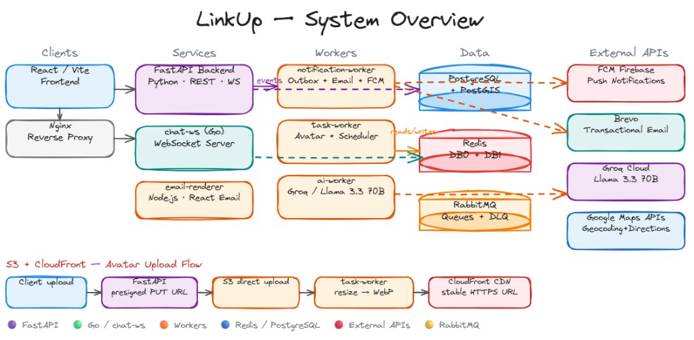

# Architecture

This file is the canonical architecture entry point for Linkup.

Also surfaced in the repo root [`README.md`](../README.md#architecture).

**מפת תיעוד לפי סוג משימה ומקורות אמת (Compose/CI/API):** [`docs/DOCUMENTATION_MAP.md`](DOCUMENTATION_MAP.md).

## High-level docs

- [`README.md`](../README.md) — product overview and getting started
- [`frontend/README.md`](../frontend/README.md) — web client architecture notes (RTL/i18n, realtime, Premium UX flow, React Query migrations כולל Stage 3b Part 2 ל-MyBookings, **MyRides** (`useQuery`/`useMutation` + WS invalidation), Stage 3b Part 6 ל-SearchRides, Stage 5 cleanup ל-MyRequests/Auth bootstrap, Stage 3d safe-subset ל-Chat polling/fetch, **auth session teardown:** **`tearDownSession` + `auth:session-expired` + Sentry/RQ 401 policy** — **FEATURE_DECISIONS `#auth-session-teardown`** / **ADR Frontend §21**; **chat outbound:** `ChatListRow` optimistic UI + `applyInboundRealMessage` / `appendMessageDedupById` + ref-scoped Idempotency-Key — ADR Frontend §2; **chat reconnect gap:** **`fetchMissedGap`** (`after` + `before=cursor`, capped multi-page REST) על `WS onOpen`; **WS transport reconnect:** **`reconnectBackoff.ts`** (exponential + jitter) ב־`useChatWebSocket` / `useReconnectingWebSocket*`; **chat-ws inbound:** read cap + typing rate limit — ADR chat-ws §7, S.7 asset hardening, Web Vitals D: Sentry RUM + dynamic vitals metrics, Orval OpenAPI codegen + CI drift gate, A11y heading/landmarks cleanup עם `usePageTitle`; **XSS:** `react/no-danger` + **`sanitizeHtml()`** + backend chat plaintext (**`SECURITY_HEADERS`** ל-CSP ב-edge nginx)
- [`docs/DEPLOYMENT.md`](DEPLOYMENT.md) — production deployment flow and rollback
- [`docs/ENGINEERING_HIGHLIGHTS.md`](ENGINEERING_HIGHLIGHTS.md) — senior-level feature and reliability highlights
- [`docs/BILLING_REFACTOR_SUMMARY.md`](BILLING_REFACTOR_SUMMARY.md) — סיכום מלא של Billing refactor (לפני/אחרי, רכיבים, השוואת Kafka, טסטים)
- [`docs/SECURITY_HEADERS.md`](SECURITY_HEADERS.md) — nginx edge hardening (TLS on 443; committed `nginx.conf` is **HTTP/1.1** unless `http2` is enabled on `listen`), browser security headers, **enforcing CSP** (`script-src` ללא **`'unsafe-inline'`**; **`frontend/public/bootstrap.js`**) + Sentry CSP `report-uri`, and how CSP complements XSS controls (plaintext chat, `sanitizeHtml`, static-SPA nonce limitations)
- [`docs/FUTURE_WORK.md`](FUTURE_WORK.md) — deferred decisions כולל S.4 OCC ל-Profile edit עתידי ו-E.5/E.6 forms scope rationale
- [`docs/FRONTEND_UPGRADE_ROADMAP.md`](FRONTEND_UPGRADE_ROADMAP.md) — פרונט: מה **כבר סגור** ב־checklist ומה **נשאר** (קבוצות manage, העלאות, CreateRide, MSW וכו׳)

## Architecture deep-dive by domain

- [`docs/architecture/API.md`](architecture/API.md) — FastAPI routes, auth, middleware, health contracts (**Billing:** checkout + **`X-Idempotency-Key`**, webhook, admin reconcile/stale-pending — סעיף Billing / Admin)
- [`docs/architecture/DATABASE.md`](architecture/DATABASE.md) — PostgreSQL/PostGIS schema, indexes, and migrations
- [`docs/architecture/EVENTS.md`](architecture/EVENTS.md) — Outbox, RabbitMQ topology, retry/DLQ flow
- [`docs/architecture/REALTIME.md`](architecture/REALTIME.md) — WebSocket architecture, Redis pub/sub, GPS/presence
- [`docs/architecture/NOTIFICATIONS.md`](architecture/NOTIFICATIONS.md) — Outbox → workers, email (Brevo + **circuit breaker**), push (FCM), in-app WS
- [`docs/architecture/AI.md`](architecture/AI.md) — AI chat-summary pipeline (**`ai-worker`**, Groq, Redis completion)
- [`docs/architecture/STORAGE.md`](architecture/STORAGE.md) — S3 presigned uploads, avatar versioning, CloudFront קריאה
- [`docs/architecture/DEVELOPMENT.md`](architecture/DEVELOPMENT.md) — local/dev architecture and setup conventions

## Supply chain & automation

- [`.github/dependabot.yml`](../.github/dependabot.yml) — scheduled PRs: npm (`/frontend`), pip על **`/backend`** (מעקב אחר **`backend/pyproject.toml`** + **`backend/uv.lock`**; אין `requirements.txt` ב-backend), Docker (`/backend`, `/frontend`, `/infrastructure/pgbouncer`)

## Operations docs

- [`docs/operations/RUNBOOK.md`](operations/RUNBOOK.md) — incident handling for common production failures
- [`docs/operations/MONITORING.md`](operations/MONITORING.md) — dashboards חיצוניים בפרודקשן (**Sentry**, **Better Stack**), Prometheus/Grafana, SLO baseline, probe exposure policy (`/livez` public, `/readyz` internal-only), ומטריקות **billing** (`billing_reconciler_*`, …)

## ADRs

- [`docs/adr/README.md`](adr/README.md)
- [`docs/adr/ARCHITECTURE_DECISIONS_BACKEND.md`](adr/ARCHITECTURE_DECISIONS_BACKEND.md)
- [`docs/adr/ARCHITECTURE_DECISIONS_FRONTEND.md`](adr/ARCHITECTURE_DECISIONS_FRONTEND.md)
- [`docs/adr/ARCHITECTURE_DECISIONS_CHAT_WS.md`](adr/ARCHITECTURE_DECISIONS_CHAT_WS.md)
