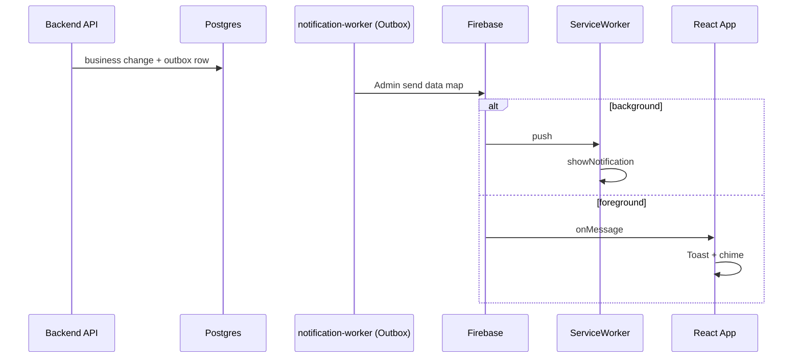

# FCM (Web Push) — למה בחרנו במסלול הזה

מסמך לראיון על **החלטות Push** ב-LinkUp. מקור מפורט: [../FCM_SYSTEM_SUMMARY.md](../FCM_SYSTEM_SUMMARY.md).

---

## 1. "Data-only" מהשרת — מה זה אומר

| | |
|--|--|
| **הגדרה** | הודעת Firebase Admin נשלחת עם מפת **`data`** (מחרוזות key/value). **אין** אצלנו שימוש בבלוק הנפרד **`notification`** של FCM API (של Firebase) בהודעות שנבנות מהשרת שלנו. |
| **מה זה לא אומר** | זה **לא** "בלי UI": בחזית עדיין יש **Toast + צליל**; ברקע ה-**Service Worker** מציג **התראת מערכת** מ-handler של `push`. |

---

## 2. למה בחרנו ב-data-only

| סיבה | הסבר |
|------|------|
| **שליטה אחידה על התצוגה** | כשמשתמשים ב-`notification` בלבד, ה-SDK/דפדפן עלולים להציג התנהגות "אוטומטית" שלא תמיד מתאימה לשכבת המוצר (כפילות foreground+background, טקסט שלא עבר i18n/פורמט אחיד). |
| **Foreground** | `onMessage` קורא `title`/`body` מ-`payload.data` (עם fallback אם ה-SDK מעלה גם `notification`) — אנחנו מחליטים על Toast אחד עקבי. |
| **Background** | ה-SW ב-`push` קורא `data.title` / `data.body` וקורא ל-`showNotification` — אותו חוזה תוכן. |
| **עקביות עם Outbox** | האירוע יוצא דרך אותו pipeline (מייל / push / websocket לפי אסטרטגיה); ה-payload ל-push הוא שכבת נתונים, לא "קסם" של פלטפורמה. |

**משפט לראיון:** "בחרנו data-only כדי שכל ההצגה — בטאב פתוח או ברקע — תעבור דרך הקוד שלנו ולא דרך שביל אוטומטי של FCM שלא תמיד נשלט."

---

## 3. מחזור חיים של הטוקן

| שלב | מה קורה |
|-----|---------|
| **אחרי login / Google / hydrate** | אם `Notification.permission === 'granted'` — קוראים `initFCM()` ו-`PATCH /users/fcm-token` עם הטוקן. |
| **לפני logout** | קודם `PATCH` עם `fcm_token: null` (בעוד ה-access token תקף), אחר כך `cleanupFCM()`, ורק אז logout — כדי שלא יישלח push לרישום ישן. |
| **הפעלה ידנית** | תפריט פרופיל / מסך FCM check. |

**למה זה חשוב בראיון:** מראה חשיבה על **ניקוי רישום** ועל סדר פעולות נגד race עם ביטול סשן.

---

## 4. זרימה ארגונית (ללא קוד)

---

## 5. Trade-offs

| יתרון | מחיר |
|--------|------|
| שליטה מלאה ב-UX | יותר לוגיקה בפרונט וב-SW |
| פחות הפתעות בין foreground ל-background | חובה לתחזק את שני הנתיבים (SW + `fcm.ts`) |

---

## 6. דיבוג

- לוגים רועשים ב-`fcm.ts` עוברים דרך **`devLog`** רק ב-`import.meta.env.DEV` — פחות רעש בפרודקשן.

---

## קישורים

- [../FCM_SYSTEM_SUMMARY.md](../FCM_SYSTEM_SUMMARY.md)  
- [ARCHITECTURE_DECISIONS_FRONTEND.md](ARCHITECTURE_DECISIONS_FRONTEND.md) (היבטי פרונט)  
- [ARCHITECTURE_DECISIONS_BACKEND.md](ARCHITECTURE_DECISIONS_BACKEND.md) (Outbox → worker → push)
