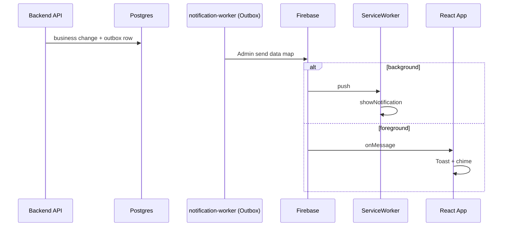

# FCM (Web Push) — למה בחרנו במסלול הזה

מסמך לראיון על **החלטות Push** ב-LinkUp. מקור מפורט: [../FCM_SYSTEM_SUMMARY.md](../FCM_SYSTEM_SUMMARY.md).

---

## 1. "Data-only" מהשרת — מה זה אומר

| | |
|--|--|
| **הגדרה** | הודעת Firebase Admin נשלחת עם מפת **`data`** (מחרוזות key/value). **אין** אצלנו שימוש בבלוק הנפרד **`notification`** של FCM API (של Firebase) בהודעות שנבנות מהשרת שלנו. |
| **מה זה לא אומר** | זה **לא** "בלי UI": בחזית עדיין יש **Toast + צליל**; ברקע ה-**Service Worker** מציג **התראת מערכת** מ-handler של `push`. |

---

## 2. למה בחרנו ב-data-only

| סיבה | הסבר |
|------|------|
| **שליטה אחידה על התצוגה** | כשמשתמשים ב-`notification` בלבד, ה-SDK/דפדפן עלולים להציג התנהגות "אוטומטית" שלא תמיד מתאימה לשכבת המוצר (כפילות foreground+background, טקסט שלא עבר i18n/פורמט אחיד). |
| **Foreground** | `onMessage` קורא `title`/`body` מ-`payload.data` (עם fallback אם ה-SDK מעלה גם `notification`) — אנחנו מחליטים על Toast אחד עקבי. |
| **Background** | ה-SW משתמש ב-`onBackgroundMessage` כנתיב ראשי; בנוסף, raw `push` event listener פועל כ-**fallback** לדפדפנים שבהם `onBackgroundMessage` לא נורה עבור data-only payloads (בעיקר Chrome כשהטאב סגור). שני ה-handlers לא יורים יחד באותו דפדפן — Firebase מדכא את ה-raw event כש-`onBackgroundMessage` מטפל בהודעה. |
| **עקביות עם Outbox** | האירוע יוצא דרך אותו pipeline (מייל / push / websocket לפי אסטרטגיה); ה-payload ל-push הוא שכבת נתונים, לא "קסם" של פלטפורמה. |

**משפט לראיון:** "בחרנו data-only כדי שכל ההצגה — בטאב פתוח או ברקע — תעבור דרך הקוד שלנו ולא דרך שביל אוטומטי של FCM שלא תמיד נשלט."

---

## 3. מחזור חיים של הטוקן

| שלב | מה קורה |
|-----|---------|
| **אחרי login / Google / hydrate** | קוראים `initFCM()` ללא תנאי — הפונקציה עצמה מבקשת הרשאה אם `"default"` ויוצאת אם `"denied"`. משווה טוקן מול `localStorage` cache — אם לא השתנה, דילוג על PATCH; אחרת `PATCH /users/fcm-token` ועדכון cache. |
| **לפני logout** | קודם `PATCH` עם `fcm_token: null` (בעוד ה-access token תקף), אחר כך `cleanupFCM()` (מוחק גם את localStorage cache של הטוקן), ורק אז logout — כדי שלא יישלח push לרישום ישן ושמשתמש הבא תמיד ישלח את הטוקן שלו. |
| **הפעלה ידנית** | תפריט פרופיל / מסך FCM check. |
| **כשהשרת שולח push לטוקן שפג/לא תקף** | Firebase Admin מעלה **`UnregisteredError`** / **`SenderIdMismatchError`**. ה־**`PushProvider`** (עם **`AsyncSession`** מאותו אירוע worker) מבצע **`update_fcm_token(..., token=None)`** ו-**`return`** (לא `raise`) — טוקן שפג הוא lifecycle event צפוי, לא שגיאה. לוג ברמת `info`. |

**למה זה חשוב בראיון:** מראה חשיבה על **ניקוי רישום** ועל סדר פעולות נגד race עם ביטול סשן.

---

## 4. זרימה ארגונית (ללא קוד)

---

## 5. Trade-offs

| יתרון | מחיר |
|--------|------|
| שליטה מלאה ב-UX | יותר לוגיקה בפרונט וב-SW |
| פחות הפתעות בין foreground ל-background | חובה לתחזק את שני הנתיבים (SW + `fcm.ts`) |

---

## 5b. Chat message push — offline fallback

| היבט | פירוט |
|------|-------|
| **בעיה** | הודעות צ'אט עברו רק דרך Redis pub/sub → chat-ws WS; אם הנמען לא מחובר ב-WebSocket, ההודעה נשמרת ב-DB אבל **שום push לא נשלח**. |
| **dual-target outbox** | `chat.message_sent` עובר עכשיו ל-`[REDIS, RABBITMQ]` באותה טרנזקציה — Redis לזמן אמת, RabbitMQ ל-push fallback. |
| **presence gate** | `handle_chat_message_push` בודק `EXISTS presence:{recipient}` ב-Redis DB 1 (key מנוהל ע"י chat-ws Go; 60s TTL). Online → דילוג. |
| **debounce** | `SET NX` עם TTL 30s פר conversation + recipient. מקסימום push אחד ל-30 שניות באותה שיחה. |
| **dispatch** | `NotificationCommand` עם template `chat_message`, channel `push` בלבד, דרך `NotificationManager`. |
| **SW collapsing** | FCM data payload כולל `conversation_id`; ה-SW משתמש ב-`tag: 'chat-' + conversation_id` + `renotify: true` — הדפדפן מחליף (לא מערם) התראות לאותה שיחה. |
| **zero-change** | Go chat-ws, `NotificationEvent` enum, `NOTIFICATION_STRATEGY` — ללא שינוי. |

**משפט לראיון:** "הודעות צ'אט עברו רק דרך Redis pub/sub — אם הנמען offline, ההודעה נבלעה. הוספתי dual-target outbox: Redis לזמן אמת, RabbitMQ לfallback. ב-handler בדקתי presence (Redis key של chat-ws), debounce ב-30s, ושלחתי push רק למי שלא מחובר. ב-SW הוספתי tag per conversation כדי שהתראות לא יערמו."

---

## 6. דיבוג

- לוגים רועשים ב-`fcm.ts` עוברים דרך **`devLog`** רק ב-`import.meta.env.DEV` — פחות רעש בפרודקשן.

---

## קישורים

- [../FCM_SYSTEM_SUMMARY.md](../FCM_SYSTEM_SUMMARY.md)  
- [ARCHITECTURE_DECISIONS_FRONTEND.md](ARCHITECTURE_DECISIONS_FRONTEND.md) (היבטי פרונט)  
- [ARCHITECTURE_DECISIONS_BACKEND.md](ARCHITECTURE_DECISIONS_BACKEND.md) (Outbox → worker → push)
