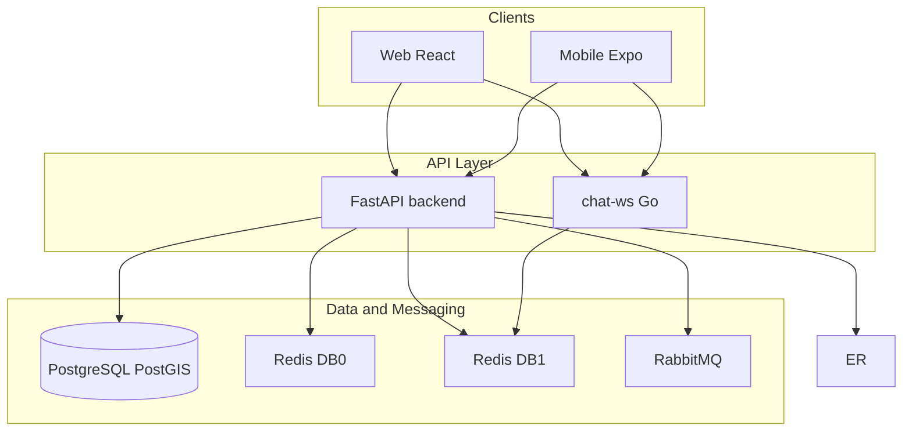

# החלטות ארכיטקטוניות (ADR) — מדריך לראיונות

מסמכים אלה מסכמים **למה** נבנתה LinkUp כפי שהיא — לא רק **מה** קיים. מקור אמת טכני נשאר במסמכי הארכיטקטורה והקוד.

**מסלול “סניור” מאוחד (נקודת כניסה + Why/Alternatives לפי פיצ'ר):** [../internal/INTERVIEW_PLAYBOOK.md](../internal/INTERVIEW_PLAYBOOK.md) · [../FEATURE_DECISIONS.md](../FEATURE_DECISIONS.md)

## סדר קריאה מומלץ לפני ראיון

1. [ARCHITECTURE_DECISIONS_BACKEND.md](ARCHITECTURE_DECISIONS_BACKEND.md) — DB, Redis, RabbitMQ, Outbox, **רינדור מיילים ב-Node (§5)**, workers, סקייל, אבטחה, **JWT `jti` + denylist ב-Redis (§18)**, **Idempotency-Key ל-request-ride-from-search (§19)** ול־**POST שליחת הודעת צ’אט (§25)**, **Billing — Postgres checkout idempotency + reconciler (§26)**, **נוסע: חיפוש מול שמירת התראה (§17)**, **Circuit Breaker — Google Maps + Brevo email (§20)**, **PgBouncer ממומש (§21)**, **צ’אט plaintext (§22)**, **rate limit split (§23)**, **audit log (§24)**.
2. [WEBSOCKETS.md](WEBSOCKETS.md) — **מתי** משתמשים ב-WebSocket, **איזה שרת**, למה לא רק REST/polling.
3. [FCM_AND_PUSH.md](FCM_AND_PUSH.md) — **למה** push ב-data-only, מחזור חיים טוקן, UX foreground/background.
4. [ARCHITECTURE_DECISIONS_CHAT_WS.md](ARCHITECTURE_DECISIONS_CHAT_WS.md) — למה Go, גבולות שירות.
5. [ARCHITECTURE_DECISIONS_FRONTEND.md](ARCHITECTURE_DECISIONS_FRONTEND.md) — React/Vite, Zod, **§2** (API + צ’אט: Idempotency-Key, **`ChatListRow`**, **`applyInboundRealMessage`**), התראות, אדמין, **i18n / לוקאל / פונטים (§10–12)** + **§21** (ניתוח סשן auth מאוחד, `CustomEvent`, Sentry 401 לעומת 403).

## מפת מערכת (תזכורת)

## מסמכי מקור בפרויקט

| נושא | מסמך |
|------|------|
| סקירה כללית | [../ARCHITECTURE.md](../ARCHITECTURE.md) (שורש), [../../README.md](../../README.md) (סקירה + Architecture Decisions) |
| פיצ'רים וסקייל | [../ENGINEERING_HIGHLIGHTS.md](../ENGINEERING_HIGHLIGHTS.md) |
| Billing refactor — סיכום מלא | [../BILLING_REFACTOR_SUMMARY.md](../BILLING_REFACTOR_SUMMARY.md) |
| אירועים ותורים | [../architecture/EVENTS.md](../architecture/EVENTS.md) |
| Real-time / WS | [../architecture/REALTIME.md](../architecture/REALTIME.md) |
| FCM | [../FCM_SYSTEM_SUMMARY.md](../FCM_SYSTEM_SUMMARY.md) |
| שגיאות API | [../ERRORS.md](../ERRORS.md) |
| פרונט | [../../frontend/docs/ARCHITECTURE.md](../../frontend/docs/ARCHITECTURE.md) |
| תסריטי וידאו (דמו / ארכיטקטורה) | [../internal/VIDEO_SCRIPT_PROJECT_DEMO.md](../internal/VIDEO_SCRIPT_PROJECT_DEMO.md), [../internal/VIDEO_SCRIPT_ARCHITECTURE.md](../internal/VIDEO_SCRIPT_ARCHITECTURE.md) |
| chat-ws | [../../chat-ws/ARCHITECTURE.md](../../chat-ws/ARCHITECTURE.md) |

## איך להשתמש בראיון

לכל החלטה במסמכי ה-ADR יש בדרך כלל: **הקשר → מה בחרנו → למה (כולל סקייל/אמינות אם רלוונטי) → אלטרנטיבה → משפט קצר לסיכום**.
