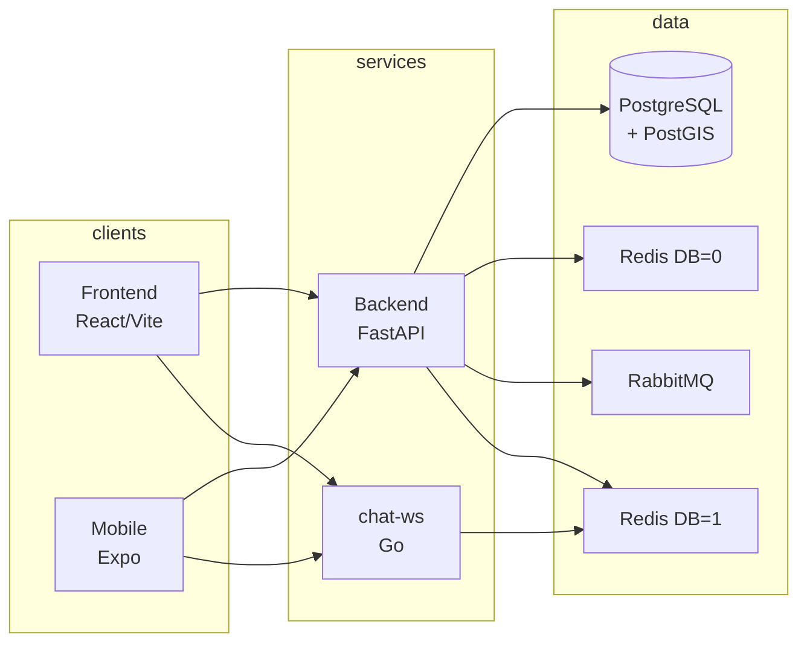

# Linkup — Ride-Sharing Platform

A full-stack ride-sharing application where drivers post rides, passengers search and book, and real-time chat with AI-powered conversation summaries keeps everyone in sync.

---

## What Linkup Does

Linkup connects drivers and passengers for shared rides. Drivers publish trips with origin, destination, date, and available seats. Passengers search, send booking requests, and get approved or rejected by drivers. Once a booking is confirmed, driver and passenger chat in real time over WebSocket. When a conversation ends, an AI pipeline (Groq / Llama) analyzes the chat and sends an email summary. The app supports Google OAuth and email/password login, profile avatars (S3), geo routing and distance calculation, and push, email, and in-app notifications—all backed by an outbox pattern for reliable event delivery.

---

## Engineering highlights (portfolio)

Single doc for **stack, scale patterns, real-time chat (disconnect / last-seen debounce), Outbox, ops, CI/CD, tests, k6 load testing, auth under concurrent load (sync vs async), phone validation, frontend refactor**: **[docs/ENGINEERING_HIGHLIGHTS.md](docs/ENGINEERING_HIGHLIGHTS.md)**.  
פרונט — רשימת ריפקטור מפורטת: **[frontend/docs/FRONTEND_REFACTOR_AND_QUALITY.md](frontend/docs/FRONTEND_REFACTOR_AND_QUALITY.md)**.  
**FCM (Web push — `data` map מהשרת; SW + Toast ב־`App.tsx` + צליל; רישום אחרי login ב־`AuthContext`, ניקוי טוקן ב-logout):** **[docs/FCM_SYSTEM_SUMMARY.md](docs/FCM_SYSTEM_SUMMARY.md)**.  
**מסך אדמין פנימי (React, `/admin`, lazy routes, סטטיסטיקות + משתמשים + נסיעות/קבוצות + Outbox + חיפוש):** **[ADMIN_DASHBOARD.md](ADMIN_DASHBOARD.md)**.  
**שגיאות API אחידות (`error_code`, `trace_id`, `LinkupError`):** **[docs/ERRORS.md](docs/ERRORS.md)** — בקאנד handlers מרוכזים; בפרונט `useErrorHandler` + `ChatErrorBoundary`; ב-chat-ws לוגים עם `slog` ותגובות JSON ל-HTTP.

---

## Architecture


```mermaid
flowchart LR
    subgraph clients
        FE[Frontend\nReact/Vite]
        MO[Mobile\nExpo]
    end

    subgraph services
        API[Backend\nFastAPI]
        WS[chat-ws\nGo]
    end

    subgraph data
        PG[(PostgreSQL\n+ PostGIS)]
        R0[Redis DB=0]
        R1[Redis DB=1]
        MQ[RabbitMQ]
    end

    FE --> API
    FE --> WS
    MO --> API
    MO --> WS
    API --> PG
    API --> R0
    API --> MQ
    API --> R1
    WS --> R1
```

- **Frontend / Mobile** → REST to backend, WebSocket to chat-ws.  
- **Backend** → PostgreSQL (data), Redis DB=0 (cache, rate limit, ride `broadcast`, outbox worker), Redis DB=1 (**chat** + **`publish_user_event`** / `user:{id}:events`, chat completion), RabbitMQ (async tasks, notifications).  
- **chat-ws** → Redis DB=1 only (subscribe to chat channels, presence, **`user:online` / `user:offline`**, and per-user domain events pattern **`user:*:events`**, fan out to connected clients).

---

## Services

| Service   | Language        | Role |
|----------|------------------|------|
| backend  | Python (FastAPI) | REST API, auth, rides, bookings, chat CRUD, **groups**, passengers (requests/matches), **admin JSON API** (`/api/v1/admin/*`), AI summary pipeline (Redis completion + outbox-worker listener), notifications, outbox worker |
| chat-ws  | Go               | WebSocket server; chat + typing + presence; Redis Pub/Sub including **`user:online` / `user:offline`** and **`user:*:events`** (ride/maintenance-style JSON to the logged-in client) |
| frontend | React / TypeScript | Web app (Vite); Hebrew RTL |
| mobile   | React Native / Expo | Mobile app (TypeScript) |

---

## Tech Stack

| Category      | Technologies |
|---------------|--------------|
| **Backend**   | Python, FastAPI, PostgreSQL, PostGIS, SQLAlchemy (async), Alembic, Redis, RabbitMQ, Firebase (FCM), S3 (**optional CloudFront** for public media URLs via `CLOUDFRONT_DOMAIN`), Groq (AI) |
| **Real-time** | Go (chat-ws), Redis Pub/Sub |
| **Frontend**  | React, TypeScript, Vite, Google Maps |
| **Mobile**    | React Native, Expo, TypeScript |
| **Infrastructure** | Docker, Docker Compose, Kubernetes (manifests in repo) |
| **Cloud / CI** | GitHub Actions, GHCR (GitHub Container Registry), Docker |
| **Scaling & reliability** | Request ID (X-Request-ID), structured JSON logging (**python-json-logger** v3+); unified **`LinkupError`** JSON responses — **[docs/ERRORS.md](docs/ERRORS.md)**; RabbitMQ retry (exponential backoff) + DLQ; pessimistic locking (booking approve/cancel); **configurable SQLAlchemy async pool** (`DB_POOL_*` in `.env`), DB indexes |

---

## Key Features

- ✅ **Rides & bookings:** ride search, booking requests, driver approve/reject; **start/end ride** from "My Bookings" (driver tab; requires at least one confirmed passenger). **My Bookings** composes passenger/driver hooks in [`useMyBookings.ts`](frontend/src/pages/MyBookings/useMyBookings.ts) with an **explicit return object** (no spread merge) so the screen’s view-model contract is visible in one file.
- ✅ **Async core flow refactor (Passenger/Booking/Ride):** core passenger-request, booking, and ride flows were migrated to SQLAlchemy 2.0 async patterns (`AsyncSession`, `select/execute`). **Bookings** are now async-only (no `db.run_sync`) and use `select(...).with_for_update()` where needed for race safety.
- ✅ **Scheduled notifications & Redis publisher:** pickup/driver reminders use the `scheduled_notifications` table (Alembic **008**); `ReminderScheduler` loads due rows and hands off to the notification handler. [`publisher.py`](backend/app/infrastructure/redis/publisher.py): **`publish_ride_event`** → `broadcast` / **DB 0**; **`publish_user_event`** → [`redis_chat_pubsub`](backend/app/infrastructure/redis/chat_pubsub.py) / **`REDIS_CHAT_URL`** (אותו DB כמו chat-ws) לערוץ `user:{user_id}:events` מ-[`keys.py`](backend/app/infrastructure/redis/keys.py). Legacy `reminder_sent` columns were removed from ORM/API after migration **008**; dead reminder/expiry CRUD and `ride_expiry.py` were deleted.
- ✅ **Frontend user event stream:** [`useUserEventStream`](frontend/src/hooks/useUserEventStream.ts) on the chat WebSocket parses **Zod**-validated `UserEvent` messages ([`wsEvents.ts`](frontend/src/types/wsEvents.ts)); **HistorySection** and My Rides / Bookings hooks consume these for active vs past UI.
- ✅ **Chat WS inbound validation:** new chat messages on the same WebSocket are validated with **`ChatMessageSchema`** ([`wsEvents.ts`](frontend/src/types/wsEvents.ts)) in [`processChatWebSocketMessage.ts`](frontend/src/pages/MessageThread/processChatWebSocketMessage.ts); validated payloads are mapped explicitly to **`MessageResponse`** (no loose `as unknown as` casts).
- ✅ **Notification worker (async):** [`notification_tasks.py`](backend/app/workers/tasks/notification_tasks.py) uses `await db.execute(select(...))` for ride-cancel fan-out (no `run_sync` in app code paths); **`ride.cancelled_by_driver`** notifies only bookings still **PENDING** or **CONFIRMED** (not already cancelled by the passenger).
- ✅ **Frontend types vs Phase 9:** `reminder_sent` removed from booking-related TypeScript types ([`api.ts`](frontend/src/types/api.ts), [`myBookings.types.ts`](frontend/src/pages/MyBookings/myBookings.types.ts)) to match the public API after migration **008**.
- ✅ **Passenger requests (בקשות טרמפ):** create request from search, cancel request, view matches; optional link from booking to request
- ✅ **Groups:** create group, join by invite code, manage members (remove, promote to admin), group rides and search; group avatar & description (S3); leave group / close group (admin)
- ✅ Real-time chat (WebSocket) between driver and passenger; **presence**: `users.last_active_at` + debounced PATCH on disconnect; **WS** `user_online` / `user_offline` for immediate header status (see `docs/architecture/REALTIME.md`)
- ✅ AI conversation summary (Groq / Llama) and email on chat end
- ✅ Push (**FCM**): מהשרת רק מפת **`data`** ב־FCM; בחזית Toast ב־`App.tsx` + צליל, ברקע SW (`push`); רישום טוקן ב־`AuthContext` אחרי login, ניקוי ב־logout; מייל (**Brevo**) — **`docs/FCM_SYSTEM_SUMMARY.md`**
- ✅ **In-app notification feed (web):** חיבור ראשי ל־**`GET /api/v1/notifications/ws?token=JWT`** דרך [`useChatNotificationsWebSocket`](frontend/src/context/useChatNotificationsWebSocket.ts) על גבי [`useReconnectingWebSocket`](frontend/src/hooks/useReconnectingWebSocket.ts); ב־**`onOpen`** (כולל אחרי reconnect) — רענון פיד, unread ואירוע מותאם `linkup-notifications-refresh`. גיבוי: [`useChatNotificationsFeed`](frontend/src/context/useChatNotificationsFeed.ts) — polling REST כל **~5 דקות**. פירוט: [`ARCHITECTURE.md`](ARCHITECTURE.md) (סעיף In-app notifications), [`docs/architecture/REALTIME.md`](docs/architecture/REALTIME.md).
- ✅ Google OAuth and email/password auth with JWT + refresh
- ✅ Geo: distance, route display, PostGIS-backed queries; **ride preview cache** (Redis, 24h) for route options + **geocode cache** (Redis, 24h, Google Geocoding) for address→coords reuse to reduce repeated external API calls
- ✅ **GPS live tracking:** driver and passengers share location during active rides (REST → Redis Pub/Sub → WebSocket); driver flow resolves `booking_id` via ride manifest (authz on the API). The web app throttles location POSTs (~1.5s) and updates map markers in place — see [`docs/architecture/REALTIME.md`](docs/architecture/REALTIME.md) (GPS Tracking, frontend subsection).
- ✅ **Group tags** on ride/booking cards (group name or "ציבורי"); RTL: route as destination ← origin; close button (×) top-left on cards
- ✅ Profile and avatar upload (S3)
- ✅ Outbox pattern for reliable event publishing to RabbitMQ
- ✅ **Internal admin dashboard (web):** lazy-loaded routes under **`/admin`** — stats, health, users (toggle active/admin), rides (list + cancel), groups, outbox (inspect + requeue FAILED), ride/booking lookup; gated by **`user.is_admin`** (מ-JWT / תשובת login); מעטפת **דסקטופ** (סיידבר קבוע, בלי drawer מובייל); mutations behind confirm + toasts; backend **`/api/v1/admin/*`** + `[admin_audit]` logging — see **[ADMIN_DASHBOARD.md](ADMIN_DASHBOARD.md)**
- ✅ Kubernetes-ready (manifests in `k8s/`)
- ✅ **API errors:** מערכת שגיאות אחידה (`error_code`, `trace_id`, payload אופציונלי), handlers ל-validation/DB/`LinkupError` — **[docs/ERRORS.md](docs/ERRORS.md)**

---

## Getting Started

**Prerequisites:** Docker, Docker Compose, Node 20+ (for local Vite dev).

```bash
git clone <repository-url>
cd Linkup
```

## הרצה מקומית

### הכנה חד-פעמית

```bash
cp .env.example .env
cp backend/.env.example backend/.env
cp chat-ws/.env.example chat-ws/.env
cp frontend/.env.example frontend/.env
# ערוך כל קובץ והכנס סודות אמיתיים
```

- **`.env` בשורש** — רק משתנים ש־`docker-compose` צורך להקמת Postgres / Redis / RabbitMQ; יישור עם `POSTGRES_*`, `REDIS_PASSWORD`, `RABBITMQ_*` ב־`backend/.env`.
- **`chat-ws/.env`** — כולל `REDIS_URL` (לדוקר: `redis://:<סיסמה>@redis:6379/1`) ו־`JWT_SECRET` זהה ל־`SECRET_KEY` ב־`backend/.env`.
- **FCM בדוקר:** `firebase-credentials.json` ממופה read-only ל־**backend** ול־**outbox-worker**; ב־`backend/.env` הגדר `FIREBASE_SERVICE_ACCOUNT_PATH` (נתיב בקונטיינר: `/app/infrastructure/firebase_core/firebase-credentials.json`).

**מיגרציות:** ב־**Docker Compose** שירות **`migrate`** מריץ `alembic upgrade head` פעם אחת לפני **backend** ו־**outbox-worker** (קונטיינר `linkup_migrate` יוצא עם `Exited (0)`); אם המיגרציה נכשלת ה־API וה־worker לא יעלו. **לוקאלי בלי Compose:** `cd backend && alembic upgrade head` (עם `db/schema.sql` כעזר) לפני `uvicorn`.

### פיתוח יומיומי

```bash
# טרמינל 1
docker compose up -d

# טרמינל 2
cd frontend && npm run dev
```

- **פרונט:** http://localhost:5173  
- **אדמין (משתמש עם `is_admin`):** http://localhost:5173/admin — פירוט API ומבנה: [`ADMIN_DASHBOARD.md`](ADMIN_DASHBOARD.md)  
- **בקאנד:** http://localhost:8000  
- **Swagger:** http://localhost:8000/docs  
- **Backend בדוקר:** `backend/entrypoint.sh` מריץ `uvicorn` (בלי `alembic` באותה שורה); מספר workers לפי **`UVICORN_WORKERS`** ב-`backend/.env` (`.env.example`: **4**; אם חסר — **1**). **Healthcheck** על המיכל בודק `GET /api/v1/health` דרך `python` (מופיע כ־`healthy` ב־`docker compose ps` אחרי `start_period`).  
- צ׳אט בפיתוח: WebSocket ל־`localhost:8081`; WS נסיעות/התראות ל־`localhost:8000/api/v1` — ראו [`frontend/src/config/env.ts`](frontend/src/config/env.ts).

ב־[`docker-compose.yml`](docker-compose.yml) שירותי **`frontend`** ו־**`nginx`** מוגדרים עם `profiles: ["prod"]` — לא עולים ב־`docker compose up -d` ללא הפרופיל. בפרופיל prod, **nginx** תלוי ב־**backend** במצב **`service_healthy`** (לא רק `started`).

### בדיקת פרודקשן

```bash
docker compose --profile prod up -d --build
```

הכל מאחורי Nginx: http://localhost:80

### פקודות שימושיות

```bash
docker compose down          # עצור
docker compose down -v       # עצור + איפוס volumes (DB וכו׳)
docker compose logs migrate  # לוג מיגרציה (אם נכשל — לבדוק כאן)
docker compose logs backend  # לוגים
docker compose ps            # סטטוס (backend: healthy / ממתין)
```

---

## Project Structure

| Folder      | Description |
|------------|-------------|
| `backend/` | FastAPI app: API, domain logic, workers (outbox, notifications, chat completion listener), Alembic migrations |
| `chat-ws/` | Go WebSocket server: Redis subscribe, JWT auth, message fan-out to clients |
| `frontend/`| React (Vite) web app; Dockerfile + `nginx.conf` לתוך image סטטי; מודול אדמין ב־`src/features/admin/` (מסלולים `/admin/*`); WebSocket — [`frontend/README.md`](frontend/README.md), חוזי JSON ב־[`docs/architecture/REALTIME.md`](docs/architecture/REALTIME.md) |
| `nginx/`   | קונפיג Nginx ל־Compose — reverse proxy (פורט 80): API, chat-ws, פרונט |
| `mobile/`  | React Native (Expo) app |
| `k8s/`     | Kubernetes base, backend, chat-ws, frontend, infra (Postgres, Redis, RabbitMQ) |
| `db/`      | Reference schema (`schema.sql`) and utility scripts; migrations live in `backend/alembic/` |
| `docs/`    | Architecture: `docs/architecture/` — API.md, DATABASE.md, EVENTS.md (outbox, DLQ, retry), REALTIME.md (GPS, chat), DEVELOPMENT.md |

---

## Observability & reliability (scale-ready)

- **Request tracing:** every request gets a unique Request ID (8 chars); returned in `X-Request-ID` header and in logs for tracing.
- **Structured logging:** JSON in production (python-json-logger); level and format via env (LOG_LEVEL, LOG_FORMAT).
- **RabbitMQ retry & DLQ:** notifications and avatar queues use exponential backoff (e.g. 5s → 30s → 5min); after max retries, messages go to Dead Letter Queues. See `docs/architecture/EVENTS.md`.
- **Pessimistic locking:** booking approve/cancel use `SELECT ... FOR UPDATE` on the ride to avoid race conditions.
- **Connection pooling:** async SQLAlchemy pool — `pool_size`, `max_overflow`, `pool_timeout`, `pool_recycle`, `pool_pre_ping` מ-`settings` / `.env` (`DB_POOL_*`); indexes on rides, bookings, group_members, passenger_requests — see `docs/architecture/DATABASE.md`.
- **Auth hardening:** bcrypt hashing/verify רץ ב-**thread pool** (`asyncio.run_in_executor`) כדי לא לחסום את event loop; **rate limit** על `/register` ועל login/refresh (Redis); OTP: `secrets`, `hmac.compare_digest`, מונה ניסיונות + איפוס בקוד חדש; **מניעת username enumeration בלוגין** (אותה תגובת שגיאה לאימייל לא קיים ולסיסמה שגויה — OWASP) — ראו `docs/ENGINEERING_HIGHLIGHTS.md` ו-`ARCHITECTURE.md` (Security).
- **Load testing (optional, Grafana k6):** scripts are organized under [`backend/k6/scripts/`](backend/k6/scripts/) (auth, rides core flows, users, groups, chat, geo, ws). Legacy wrappers remain at [`backend/load_test.js`](backend/load_test.js) and [`backend/load_test_rides.js`](backend/load_test_rides.js). דורש הכנת `backend/.env` (זמנית `DEBUG=True`, `RATE_LIMIT_AUTH_MAX_REQUESTS` גבוה) ו־**`docker compose up -d --force-recreate backend`**. פירוט: [`backend/README.md`](backend/README.md) ו־[`docs/ENGINEERING_HIGHLIGHTS.md`](docs/ENGINEERING_HIGHLIGHTS.md) (סעיף 12).

---

## Architecture Decisions

- **Go for chat-ws (not Python).** WebSocket servers benefit from low per-connection overhead and high concurrency. Go’s goroutines and small footprint fit many idle connections; the service does no DB or business logic—only subscribe to Redis and push to clients. Keeping it in Go avoids pulling the full Python stack into the real-time path.

- **Redis DB separation (DB=0 vs DB=1).** Backend uses Redis for cache, rate limiting, and outbox-related state on DB=0. Chat traffic (pub/sub for messages and completion events) uses DB=1 so that chat-ws and the backend’s chat-completion listener can share the same Redis instance without key or namespace clashes and without backend cache evictions affecting chat.

- **Redis completion listener + outbox-worker for AI chat summary (not a separate service).** The AI flow is “on conversation end, analyze and persist.” The backend publishes a completion event to Redis DB=1; the outbox-worker subscribes and runs `handle_conversation_completion`. This keeps deployment surface small while preserving async execution.

- **Outbox pattern.** Notifications (email, push) and other side effects are triggered by domain events. Publishing directly to RabbitMQ in the same transaction as the DB write would risk losing events on crash or broker failure. Writing the event to an `outbox_events` table in the same transaction, then having a worker poll and publish to RabbitMQ, keeps “at-least-once” delivery and keeps the API response fast and independent of broker latency.

---

## CI/CD

All three services have GitHub Actions workflows that run on 
push to `main` or `develop` (only when relevant files change).

| Service   | Workflow | Steps |
|-----------|----------|-------|
| backend   | `backend-ci.yml`  | lint (Ruff), format check, migrations (`alembic upgrade head`), tests (pytest), Docker build → push to GHCR |
| chat-ws   | `chat-ws-ci.yml`  | build, vet, Docker build → push to GHCR |
| frontend  | `frontend-ci.yml` | ESLint, build (`tsc -b` + Vite), Docker build → push to GHCR |

Docker images are published to GitHub Container Registry on every push to `main`:
- `ghcr.io/Itamarabir1/linkup-backend:latest`
- `ghcr.io/Itamarabir1/linkup-chat-ws:latest`
- `ghcr.io/Itamarabir1/linkup-frontend:latest`

---

## Known Gaps (Current State)

- **Public media URLs:** when **`CLOUDFRONT_DOMAIN`** is unset, avatar/group image reads use **short-lived presigned GET** from the API / storage layer; when set, responses can expose **stable HTTPS URLs** via CloudFront in front of the same S3 bucket — see `backend/README.md` (Media) and `ARCHITECTURE.md` (Infrastructure).
- `app.db.models` is a registry for domain/API model loading and Alembic autogenerate context; it is not intended to be an exhaustive export of every ORM/infrastructure model in the repo.
- `chat-ws` CI currently runs `go build` + `go vet` (no `go test` step in the workflow yet).
